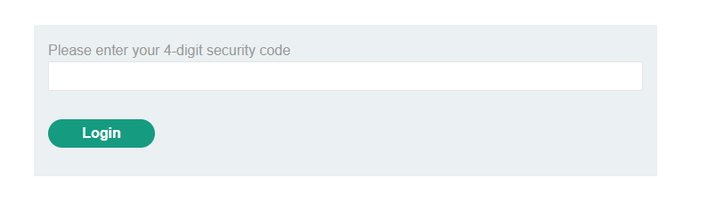
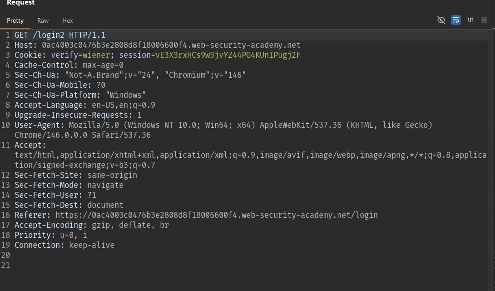
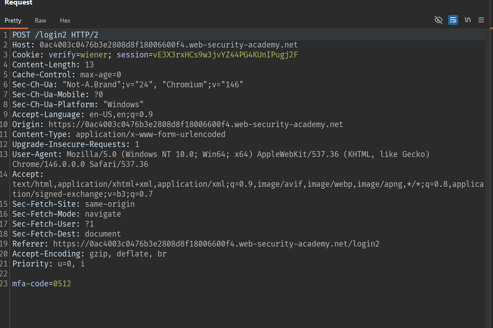
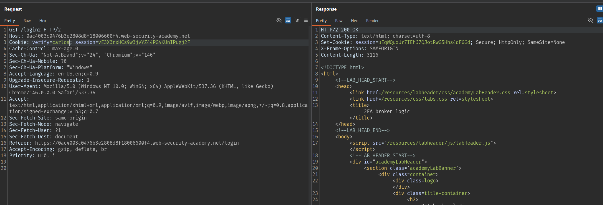
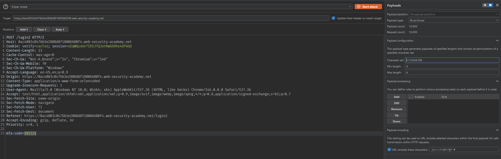
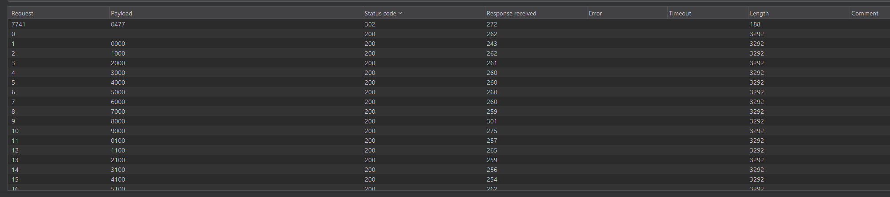
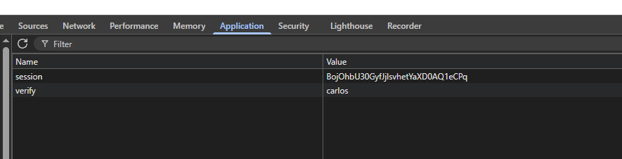
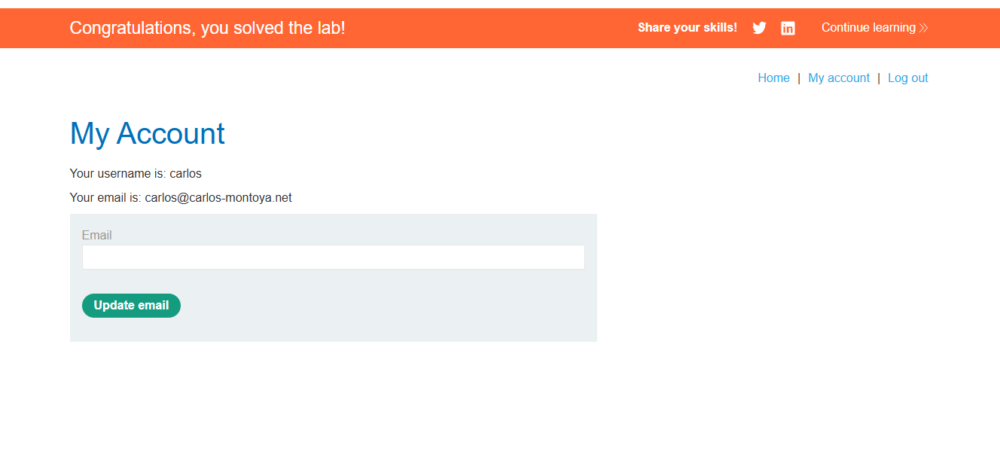

# Lab 2FA broken logic

## Mô tả lab

Logic xác thực 2FA bị lỗi. Ứng dụng lưu username cần verify trong cookie phía client, thay vì ràng buộc chặt chẽ với session ở phía server. Điều này cho phép attacker đăng nhập bằng tài khoản hợp lệ của mình, sau đó sửa cookie và brute-force mã 2FA của user khác.

## Các bước thực hiện

Login tài khoản lab cung cấp, ứng dụng chuyển sang bước nhập mã 2FA.



## Phân tích request

Quan sát response sau khi login, ta thấy server set 1 cookie:

```http
Cookie: verify=wiener
```



Cookie này tiếp tục được gửi trong request tới trang nhập mã 2FA:



```http
Cookie: verify=wiener; session=vE3X3rxHCs9w3jvYZ44PG4KUnIPugj2F
```

Thử sửa cookie verify

```http
verify=carlos
```

Sau đó gửi lại request tới:

```http
GET /login2
```



Kết quả cho thấy ứng dụng vẫn chấp nhận request và dường như đã khởi tạo bước 2FA cho user `carlos`, mặc dù ta chưa từng đăng nhập đúng password của `carlos`.

`carlos` có `session=uEqWQuxUr7IEhJ7QJotRwG5Hhs4dF6Gd`.

## Khai thác

Mã 2FA gồm 4 chữ số, nên có thể brute-force từ:

```text
0000 - 9999
```

Gửi request submit mã 2FA sang Burp Intruder.





Sau khi tìm mã 2FA, sửa cookie.





Lab solved.
