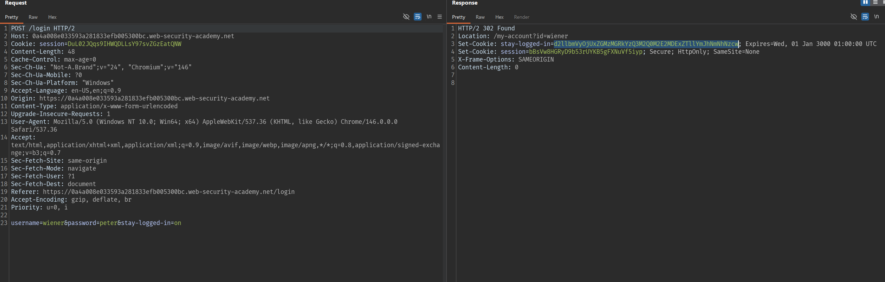
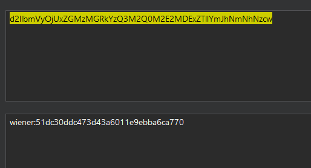
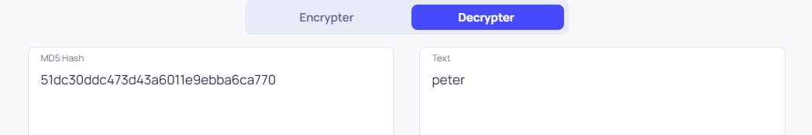
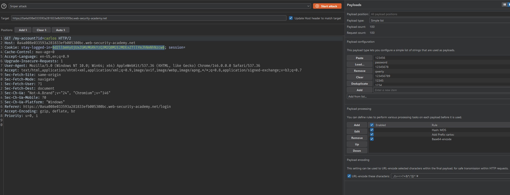
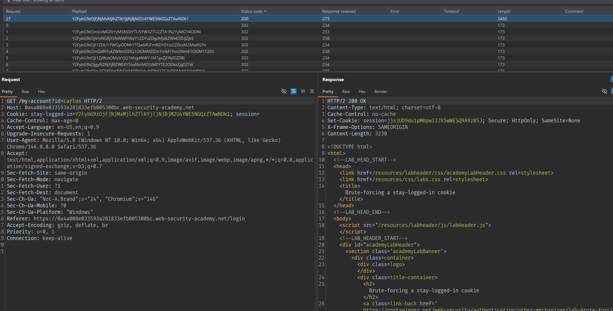
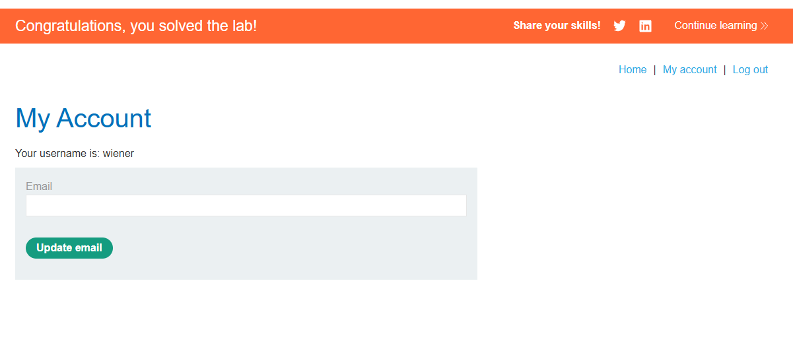

# Lab: Brute-forcing a stay-logged-in cookie

## Mô tả lab

Ứng dụng có chức năng đăng nhập và tùy chọn `stay logged in` để duy trì phiên đăng nhập. Khi chọn, server tạo một cookie để ghi nhớ user. Tuy nhiên, cấu trúc cookie được tạo từ username kết hợp với hash MD5 của password.

## Các bước thực hiện

## Phân tích chức năng stay logged in

Đăng nhập tài khoản lab cung cấp, bật tùy chọn `Stay logged in`. Response trong Burp Suite:



Cookie này dùng để duy trì trạng thái đăng nhập của user.

## Decode cookie



Sau khi decode, cookie có dạng:

```text
wiener:51dc30ddc473d43a6011e9ebba6ca770
```

Decode MD5:



Vậy cấu trúc cookie là:

```text
base64(username + ":" + md5(password))
```

## Khai thác

Đã biết username là `carlos`, ta chỉ cần brute-force password bằng cách tạo các cookie dạng:

```text
carlos:md5(candidate_password)
```

Sau đó Base64 encode toàn bộ chuỗi và đưa vào cookie:

## Tạo payload cookie

Với mỗi password trong danh sách [passwords](passwords.txt), tạo cookie theo công thức:

```text
base64("carlos:" + md5(password))
```



Payload list gồm các giá trị Base64 được tạo từ:

```text
carlos:md5(candidate_password)
```

Ở payload processing thêm rule:

```
Hash: MD5
Add prefix: peter:
Encode: Base64-encode
```





Lab solved.
