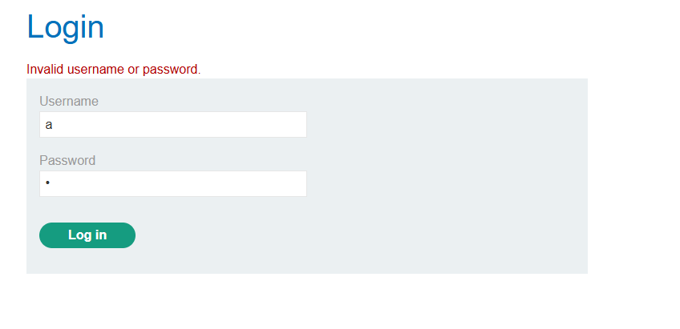
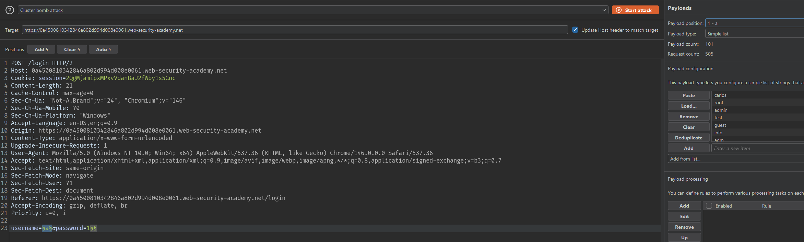
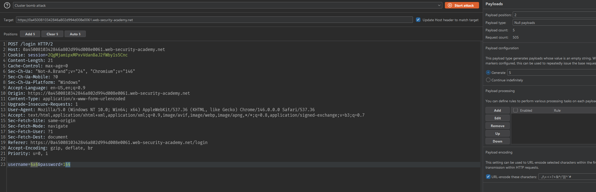
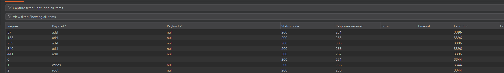
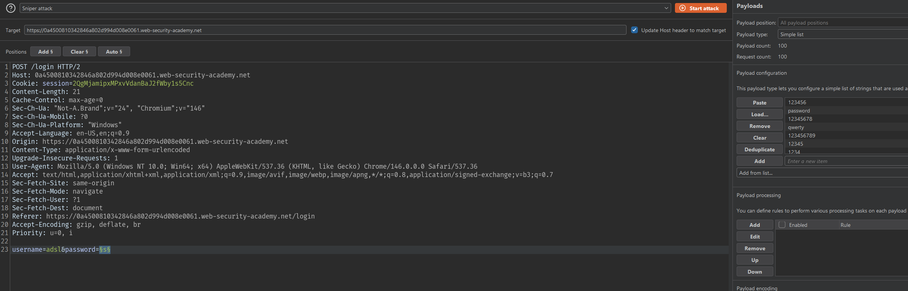
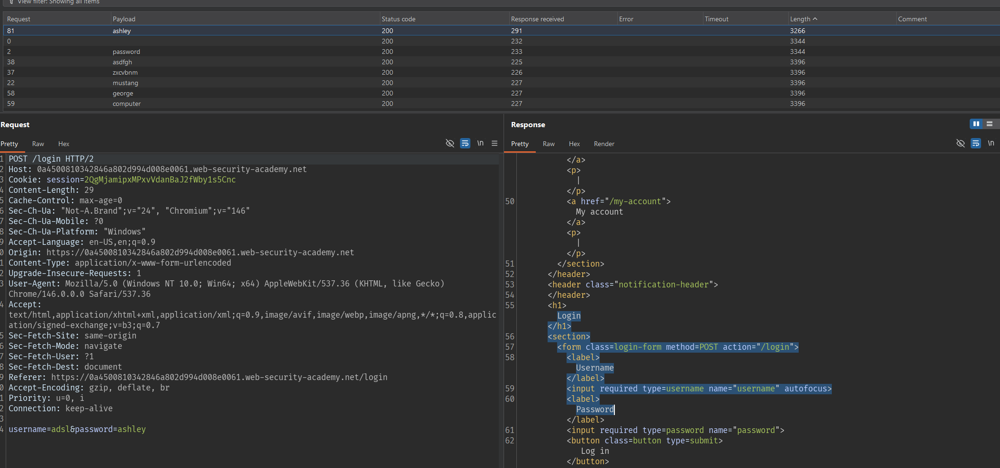
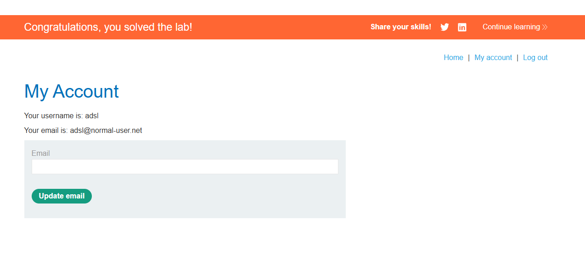

# Lab: Username enumeration via account lock

## Mô tả lab

Cơ chế lockout chỉ được kích hoạt đối với username tồn tại. Với username không tồn tại, thử sai nhiều lần, ứng dụng vẫn chỉ trả về thông báo lỗi đăng nhập thông thường.

## Các bước thực hiện

## Kiểm tra cơ chế lockout

Đầu tiên, thử với 1 username ngẫu nhiên có khả năng không tồn tại.

Sau đó gửi nhiều request đăng nhập sai liên tiếp để kiểm tra ứng dụng có khóa theo IP hay không.

Response vẫn chỉ trả về:



## Enumerate username bằng account lock

Thử nhiều lần đăng nhập sai cho từng username trong danh sách [usernames](usernames.txt) để xem username nào bị lock.

```text
Attack type: Cluster bomb
Payload 1: danh sách usernames
Payload 2: Null payloads, 5 lần
```







Quan sát response khác biệt, ta thấy thông báo dạng:

```text
You have made too many incorrect login attempts. Please try again in 1 minute(s).
```

Điều này chứng minh username đó tồn tại.

Username tìm được:

```text
adsl
```

## Brute-force password

Tiếp tục brute-force password bằng danh sách [passwords](passwords.txt).



1 response khác biệt không chứa thông báo lỗi.



Password tìm được:

```text
ashley
```
Login



Lab solved.