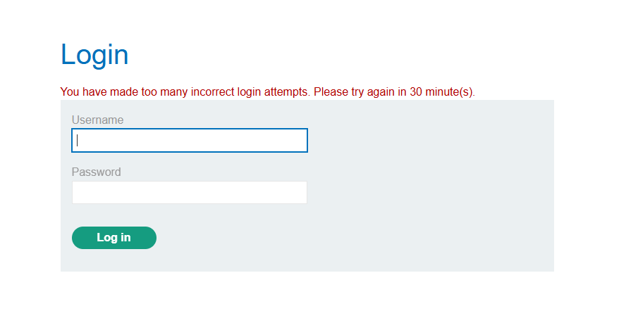
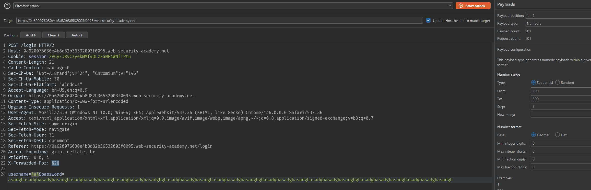
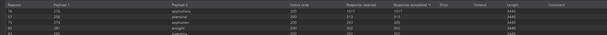
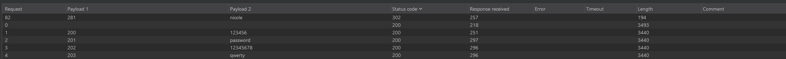
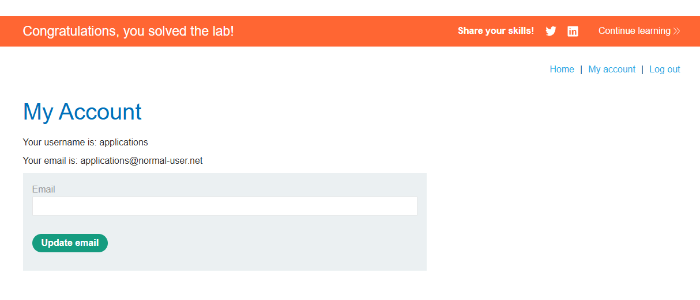

# Lab: Username enumeration via response timing

## Mô tả lab

Bài lab này thuộc nhóm lỗi xác thực, trong đó ứng dụng không để lộ thông tin qua nội dung thông báo lỗi, mà qua thời gian phản hồi của server.

## Các bước thực hiện

### Phân tích phản hồi đăng nhập

Đầu tiên, thử đăng nhập bằng một username và password ngẫu nhiên. Ứng dụng trả về thông báo lỗi:

```text
Invalid username or password
```

Điều này cho thấy không thể dò username bằng nội dung response như các bài trước.

### Dò username

- Payload: danh sách [username](username.txt)

Kết quả ban đầu không rõ ràng vì ứng dụng có cơ chế chống brute force, khiến các request sau đó bị ảnh hưởng.



### Bypass cơ chế khóa

Gợi ý của lab cho biết có thể vượt qua cơ chế khóa bằng cách chỉnh sửa header HTTP đơn giản.

```http
X-Forwarded-For: <giá trị bất kỳ>
```

Attack type: Pitchfork attack

Như vậy mỗi request sẽ có một giá trị `X-Forwarded-For` khác nhau, giúp vượt qua giới hạn brute force.

### Dùng password dài để làm lộ timing difference

Sau khi bypass được cơ chế khóa, kết quả timing vẫn chưa đủ rõ ràng. Lúc này điểm cần chú ý là password.

Với username hợp lệ, backend có xu hướng xử lý kiểm tra password sâu hơn. Nếu dùng một password dài, thời gian xử lý khi username đúng sẽ tăng lên rõ hơn so với khi username sai.



Kết quả dò được username:



### Brute force password

- Payload: danh sách [password](password.txt)





Lab solved.