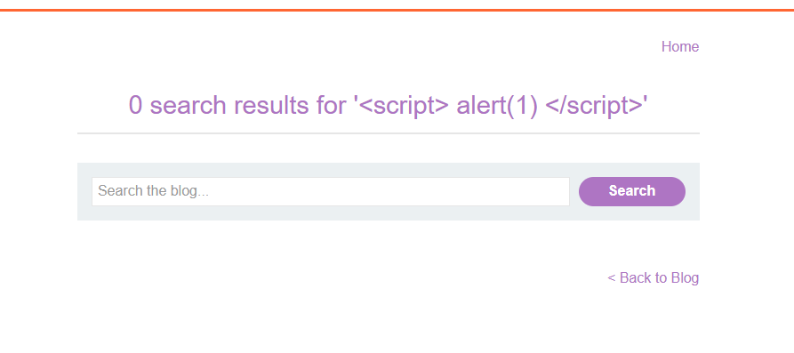
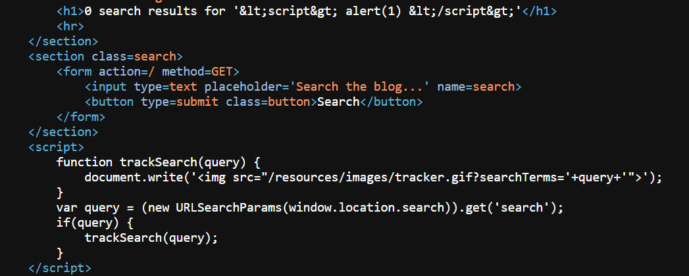
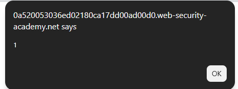

# Lab: DOM XSS in `document.write` sink using source `location.search`

## Mô tả lab

Bài lab này thuộc nhóm lỗi DOM-based XSS. Mục tiêu của bài lab là chèn được payload khiến JavaScript thực thi trong trình duyệt và hoàn thành lab.

## Các bước thực hiện

### Phân tích chức năng tìm kiếm



Thử một payload XSS đơn giản nhưng không thành công. Điều đó cho thấy nếu có lỗ hổng thì nó không nằm ở phần HTML do server render trực tiếp.

### Check source

Xem source code và các script của trang.



Tại đây có thể thấy một đoạn JavaScript lấy giá trị từ `location.search`, rồi dùng `document.write` để chèn dữ liệu đó vào thuộc tính `src` của một thẻ `` dùng cho mục đích theo dõi hoặc tracking.

Điều này rất nguy hiểm vì `document.write` sẽ tạo HTML trực tiếp trong DOM.

### Quan sát HTML sau khi JavaScript xử lý


Lúc này có thể thấy chuỗi tìm kiếm đã được chèn vào bên trong một thẻ ``. Dù thử chèn thẻ `<script>` bình thường thì nó vẫn chỉ nằm trong một chuỗi ký tự, nên chưa gây ra tác động gì.

### Chèn payload

Payload phù hợp là:

```html
"><script>alert(1)</script>
```




Lab solved.

