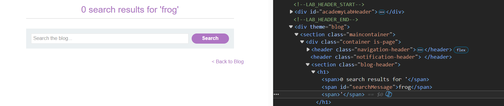
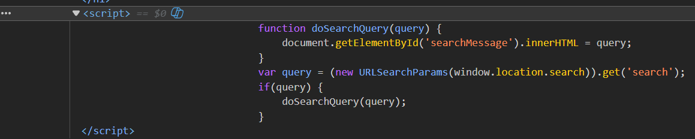
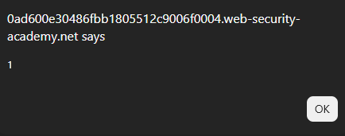
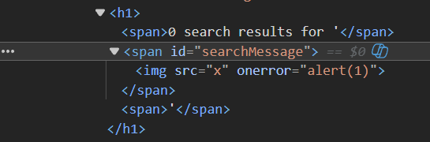

# Lab: DOM XSS in `innerHTML` sink using source `location.search`

## Mô tả lab

Bài lab này thuộc nhóm lỗi DOM-based XSS. Mục tiêu của bài lab là chèn được payload XSS để trình duyệt thực thi JavaScript và hoàn thành lab.

## Các bước thực hiện

### Phân tích chức năng tìm kiếm

Thực hiện một tìm kiếm bình thường.



Xem source hoặc script của trang, có thể thấy nếu tham số tìm kiếm tồn tại trong URL thì một phần tử `<span>` trên trang sẽ được cập nhật bằng `innerHTML`.



Khi dữ liệu từ URL đi thẳng vào `innerHTML`, trình duyệt sẽ parse nó như HTML. Vì vậy, chỉ cần chèn đúng payload thì có thể tạo ra phần tử HTML mới và kích hoạt JavaScript.

### Payload XSS

```html

```




Lab solved.

