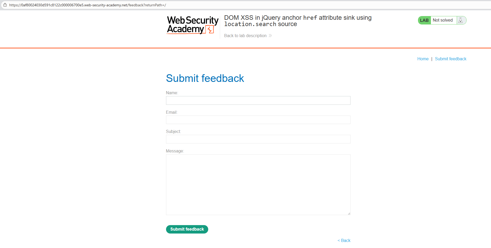
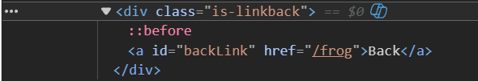
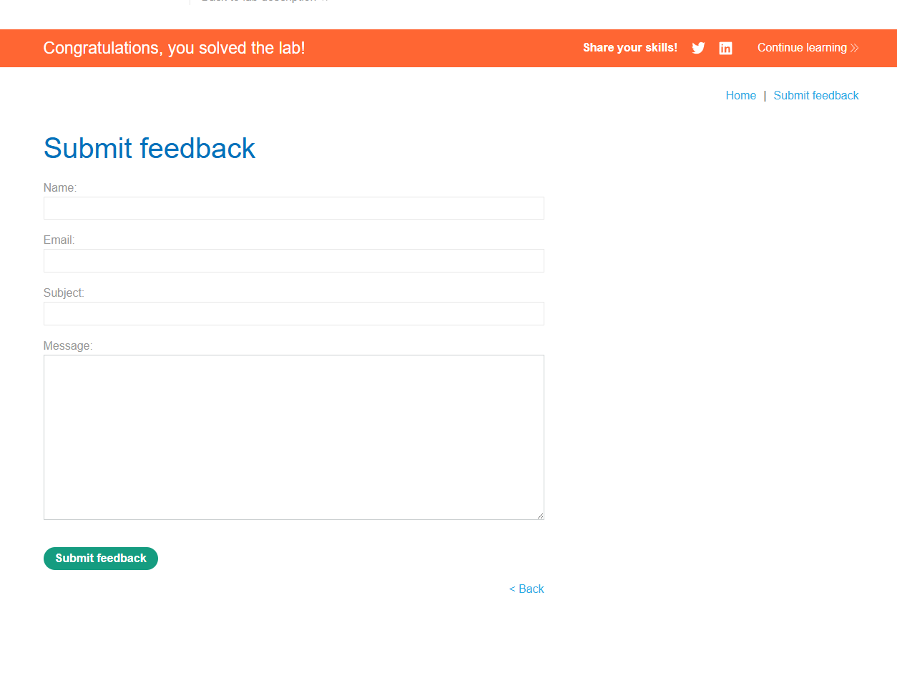
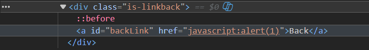

# Lab: DOM XSS in jQuery Anchor `href` Attribute Sink Using `location.search` Source

## Mô tả lab

Bài lab này thuộc nhóm lỗi DOM-based XSS. Mục tiêu của bài lab là khiến "back" link thực thi JavaScript và hiển thị hộp thoại chứa nội dung cookie của người dùng.

## Các bước thực hiện

### Phân tích



Lúc đầu chưa thấy rõ tham số `returnPath` được dùng ở đâu. Vì vậy, thay thử URL thành:

```text
/feedback?returnPath=/frog
```

Sau đó kiểm tra HTML của trang.



Kết quả cho thấy giá trị của `returnPath` được gán vào thuộc tính `href` của một liên kết có id là `backLink`. Điều này xác nhận dữ liệu từ URL đang đi thẳng vào một thuộc tính HTML quan trọng.


### Payload

Vì `href` chấp nhận URI dạng `javascript:`, ta sử dụng payload:

```text
/feedback?returnPath=javascript:alert(1)
```




Lab solved.

