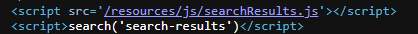
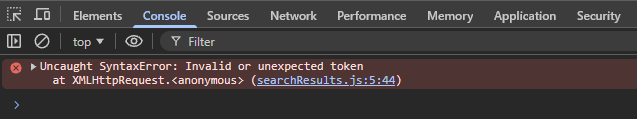
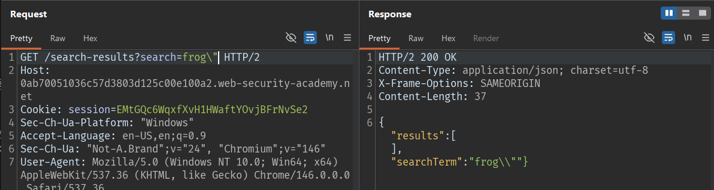
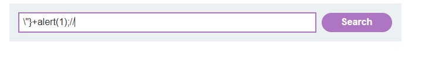
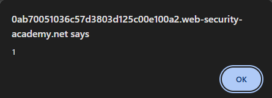
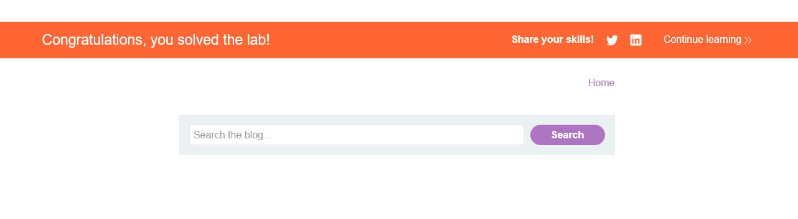
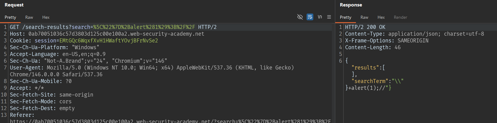

# Lab: Reflected DOM XSS

## Mô tả lab

Bài lab này thuộc nhóm lỗi Reflected DOM XSS. Ứng dụng phản hồi lại dữ liệu người dùng nhập vào trong response dạng JSON, sau đó JavaScript phía client sử dụng dữ liệu này và đưa vào các sink nguy hiểm. Mục tiêu của bài lab là khai thác lỗ hổng DOM XSS để thực thi JavaScript và hiển thị hộp thoại `alert()`.

## Các bước thực hiện

### Phân tích chức năng tìm kiếm

Đầu tiên, nhập một từ khóa bất kỳ vào ô tìm kiếm và quan sát response trả về.



Kết quả cho thấy giá trị search được phản hồi trong response dạng JSON. Dữ liệu người dùng nhập vào được đưa vào trường chứa search term.

### Kiểm tra khả năng thoát chuỗi

Thử nhập ký tự `\` vào search term để xem ứng dụng xử lý dữ liệu như thế nào.



Sau khi gửi request, ứng dụng hiển thị lỗi JavaScript trong console. Điều này cho thấy input của mình đã làm thay đổi luồng xử lý JavaScript phía client.

Nguyên nhân là server có escape dấu `"` trong response, nhưng khi truyền payload có chứa:

```text
\"
```



thì phía client xử lý khiến dấu `"` có thể thoát ra khỏi chuỗi JavaScript hiện tại.

Từ đó, ta có thể đóng chuỗi hiện tại, chèn JavaScript mới, rồi comment phần code còn lại.

### Payload

Dựa vào phân tích trên, ta thử payload:

```text
\"}+alert(1);//
```







Lab solved.

