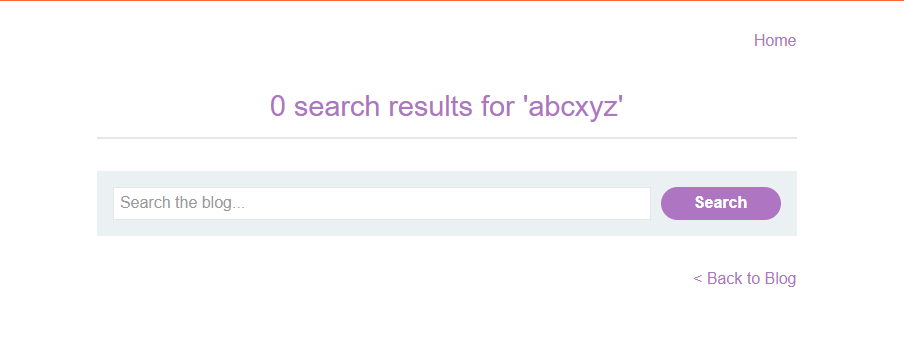
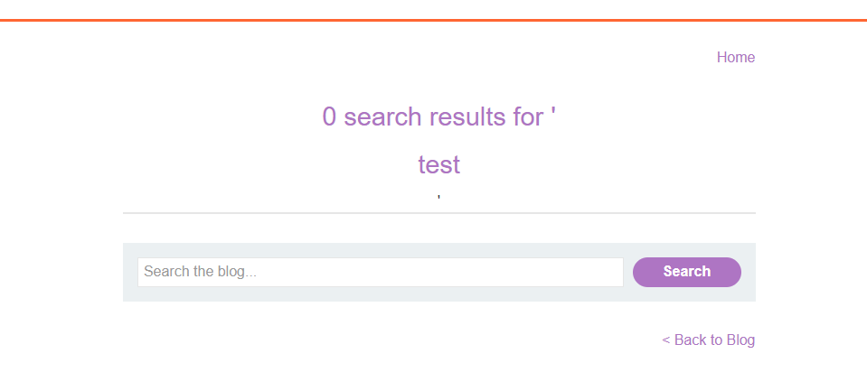
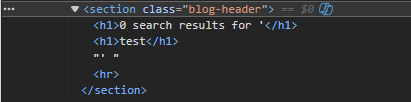
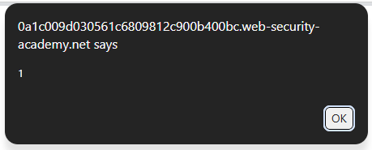
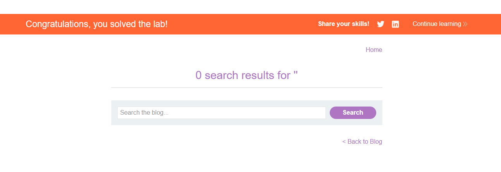

# Lab: Reflected XSS into HTML context with nothing encoded

## Mô tả lab

Bài lab này thuộc nhóm lỗi Reflected XSS. Ứng dụng có chức năng tìm kiếm, và giá trị mà người dùng nhập vào ô search sẽ được phản chiếu lại ngay trên trang kết quả. Mục tiêu của bài lab là chèn được payload XSS để thực thi.

## Các bước thực hiện

### Phân tích chức năng tìm kiếm

Đầu tiên, truy cập trang web blog của lab và thử tìm kiếm một từ bất kỳ.



Tiếp theo, thử nhập một đoạn HTML đơn giản vào ô tìm kiếm:

```html
<h1>test</h1>
```





Kết quả cho thấy chuỗi này xuất hiện trong phản hồi HTML mà không bị encode thành dạng như `&lt;h1&gt;test&lt;/h1&gt;`.

Điều đó chứng tỏ ứng dụng đang chèn input của người dùng trực tiếp vào HTML response. Đây là dấu hiệu rất rõ cho thấy có thể khai thác XSS.

### Chèn payload XSS

Sau khi xác định được dữ liệu không bị encode, bước tiếp theo là thử payload XSS đơn giản nhất:

```html
<script>alert(1)</script>
```





Lab solved.

