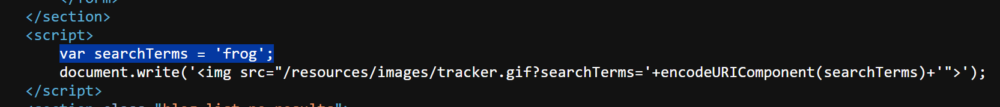
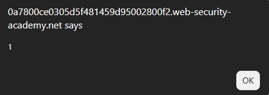
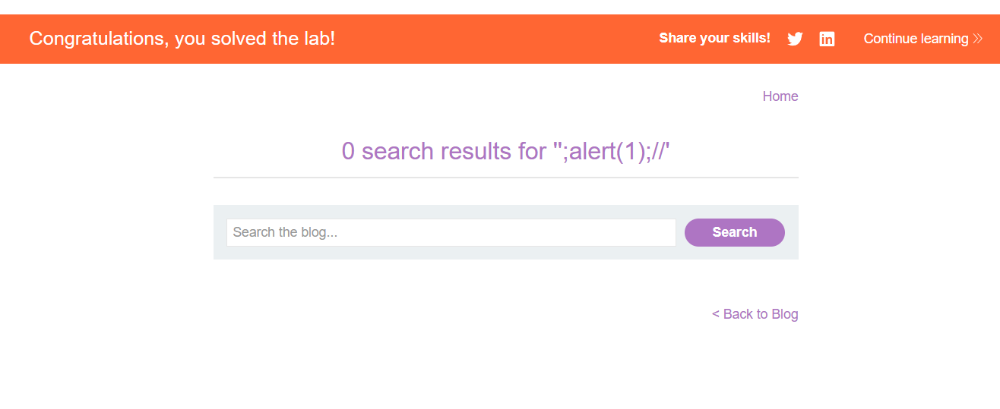
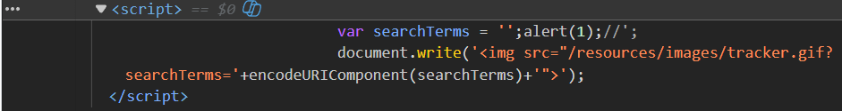

# Lab: Reflected XSS into a JavaScript string with angle brackets HTML encoded

## Mô tả lab

Bài lab này thuộc nhóm lỗi Reflected XSS. Mục tiêu của bài lab là khai thác lỗ hổng để chèn và thực thi mã JavaScript bằng cách phá vỡ chuỗi JavaScript hiện có.

## Các bước thực hiện

## Phân tích chức năng tìm kiếm

Nhập một từ khóa bất kỳ vào ô tìm kiếm và quan sát response.



Thấy rằng giá trị search được chèn vào trong một biến JavaScript dạng string. Điều này cho thấy có khả năng xảy ra XSS nếu không escape đúng.

### Payload

Dựa vào kết quả trên, ta xây dựng payload:

```
';alert(1);//
```





Lab solved.

