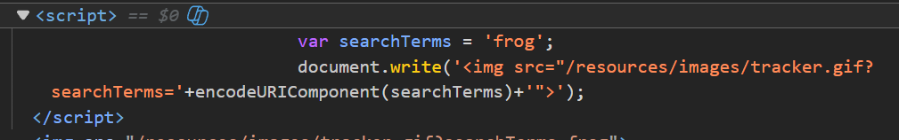
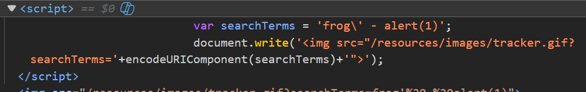
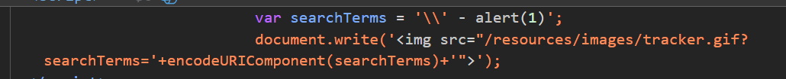
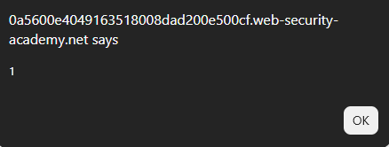
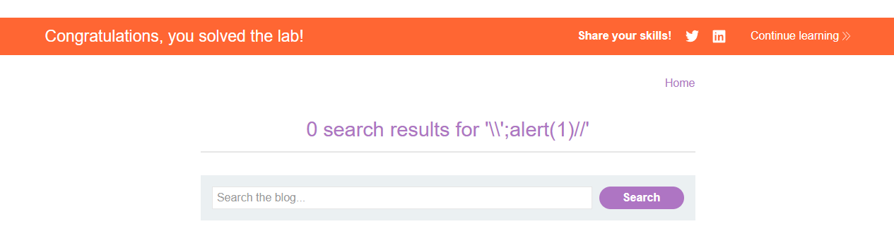
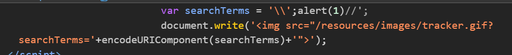

# Lab: Reflected XSS into a JavaScript string with angle brackets and double quotes HTML-encoded and single quotes escaped

## Mô tả lab

Bài lab này thuộc nhóm lỗi Reflected XSS. Một số ký tự nguy hiểm đã được xử lý. Mục tiêu của bài lab là khai thác XSS để hiển thị hộp thoại `alert()`.

## Các bước thực hiện

## Phân tích chức năng tìm kiếm

Đầu tiên, nhập một input bất kỳ để kiểm tra phản hồi trong response.



Tiếp theo, thử escape khỏi chuỗi:

```text
frog' - alert(1)
```



Khi gửi dấu single quote `'`, server escape nó thành:

```javascript
\'
```

Ta sẽ thử escape `\` bằng cách thêm dấu `\`:

```javascript
\' - alert(1)
```



Trong JavaScript, `\\` được hiểu là một backslash literal, còn dấu `'` phía sau không còn bị escape nữa. Nhờ đó, dấu `'` có thể đóng chuỗi JavaScript hiện tại.

## Payload

Sau khi escape khỏi chuỗi, ta cần comment phần còn lại bằng `//` để làm JavaScript hợp lệ.

```javascript
\';alert(1)//
```





Lab solved.

