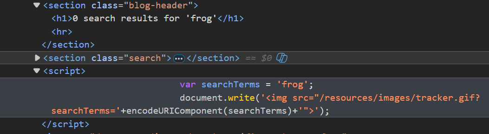
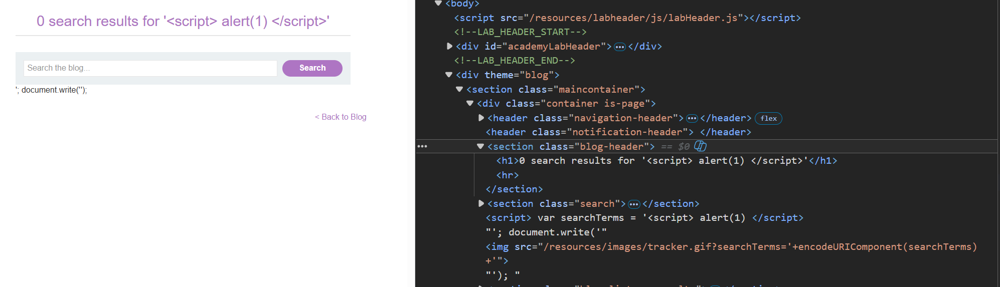
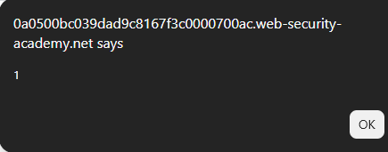
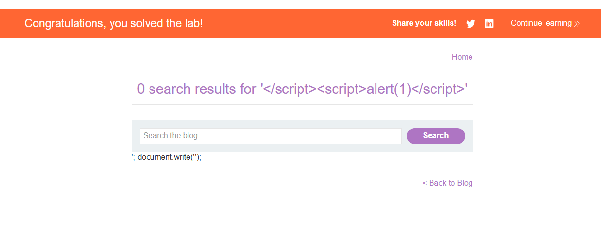
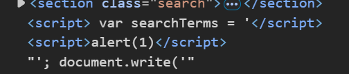

# Lab: Reflected XSS into a JavaScript string with single quote and backslash escaped

## Mô tả lab

Bài lab này thuộc nhóm lỗi Reflected XSS. Mặc dù dấu single quote `'` và dấu backslash `\` đã được escape nên không thể thoát khỏi chuỗi JavaScript theo cách thông thường, ứng dụng vẫn cho phép chuỗi `</script>` xuất hiện trong input. Điều này khiến HTML parser có thể hiểu `</script>` là thẻ đóng của đoạn script hiện tại.

## Các bước thực hiện

## Phân tích chức năng tìm kiếm

Đầu tiên, nhập một search term bất kỳ để kiểm tra vị trí input được phản hồi.



Kết quả cho thấy giá trị search được phản hồi ở hai vị trí:

1. Phần blog header.
2. Đoạn JavaScript dùng cho search tracking.

Thử payload XSS đơn giản:



Kết quả cho thấy chuỗi `</script>` trong input đã đóng thẻ `<script>` hiện tại.

## Payload

Từ kết quả trên, ta tận dụng HTML parser để đóng thẻ `<script>` hiện tại và tạo một thẻ `<script>` mới.

```javascript
</script> <script> alert(1) </script>
```





Lab solved.

