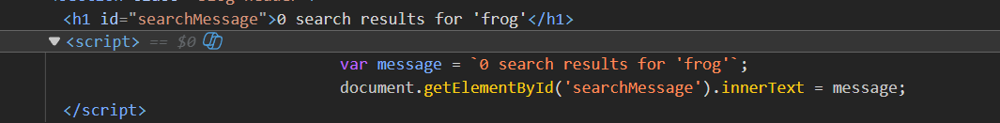
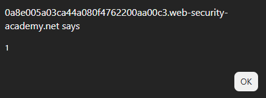
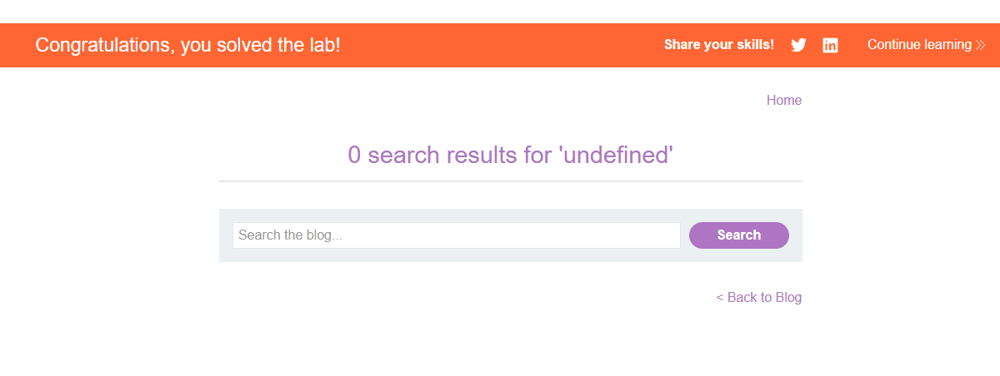
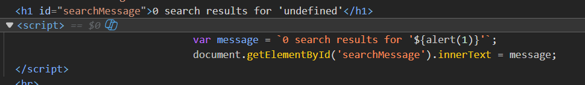

# Lab: Reflected XSS into a template literal with angle brackets, single, double quotes, backslash and backticks Unicode-escaped

## Mô tả lab

Bài lab này thuộc nhóm lỗi Reflected XSS. Lỗ hổng nằm trong chức năng search của blog. Input nằm bên trong dấu backtick. Mục tiêu của bài lab là khai thác XSS.

## Các bước thực hiện

## Phân tích chức năng tìm kiếm

Đầu tiên, nhập một chuỗi bất kỳ. Sau khi submit, trang hiển thị kết quả tìm kiếm:



Input của người dùng được đưa vào bên trong một dấu backtick.

Khi trình duyệt parse template literal, biểu thức bên trong `${...}` sẽ được thực thi như JavaScript.

Đọc thêm: [template literal](https://developer.mozilla.org/en-US/docs/Web/JavaScript/Reference/Template_literals)
## Payload

Payload sử dụng:

```javascript
${alert(1)}
```





Lab solved.

