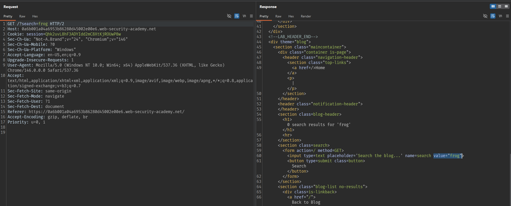
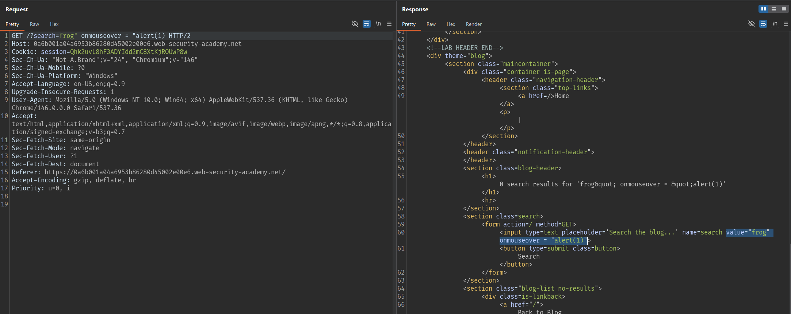

# Lab: Reflected XSS into attribute with angle brackets HTML-encoded

## Mô tả lab

Bài lab này thuộc nhóm lỗi Reflected XSS. Mục tiêu của bài lab là chèn được một attribute độc hại để khi người dùng tương tác với phần tử HTML đó, JavaScript sẽ được thực thi.

## Các bước thực hiện

### Phân tích chức năng tìm kiếm

Đầu tiên, thực hiện một lần tìm kiếm bình thường và kiểm tra phản hồi.

Giá trị search được phản chiếu ở:

- Phần text mô tả kết quả
- Ô tìm kiếm được điền sẵn giá trị trước đó

Từ đây có thể đoán rằng nếu có XSS thì khả năng cao sẽ xảy ra ở ngữ cảnh thuộc tính HTML, chứ không phải trong phần text thông thường.



### Chèn payload

Payload sử dụng là:

```text
" onmouseover="alert(document.domain)
```



Lab solved.