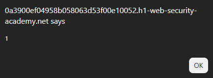
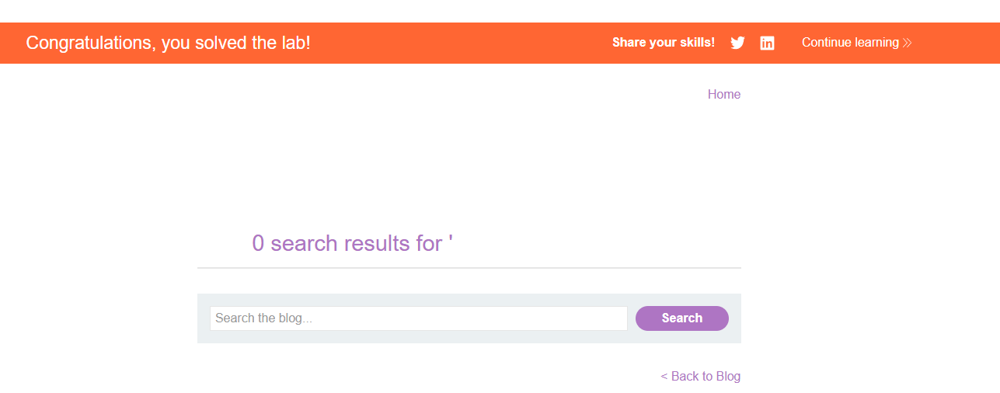
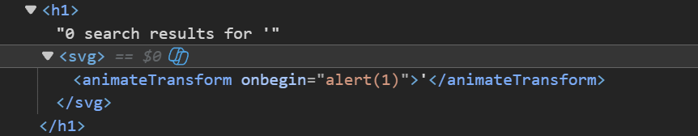

# Lab: Reflected XSS with some SVG markup allowed

## Mô tả lab

Bài lab này thuộc nhóm lỗi Reflected XSS. Lỗ hổng nằm trong chức năng tìm kiếm của website. Ứng dụng có filter/WAF chặn nhiều HTML tag phổ biến, tuy nhiên vẫn bỏ sót một số tag và event thuộc SVG markup. Mục tiêu của bài lab là khai thác XSS.

## Các bước thực hiện

Các bước ban đầu gần như giống với lab sau:

- **Reflected XSS into HTML context with most tags and attributes blocked**

## Payload

Vì tag `<svg>` và `<animatetransform>` được phép, đồng thời event `onbegin` không bị chặn, ta có thể tạo payload:

```html
<svg><animatetransform onbegin="alert(1)">
```





Lab solved.

