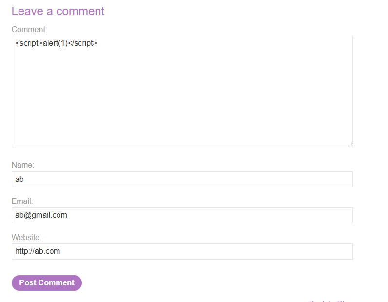
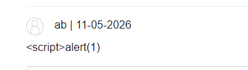
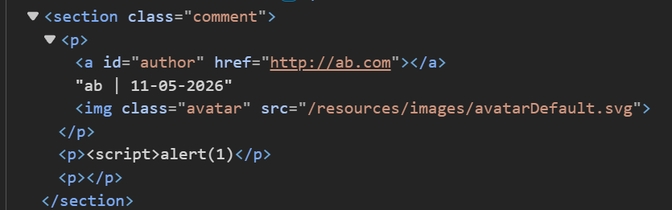
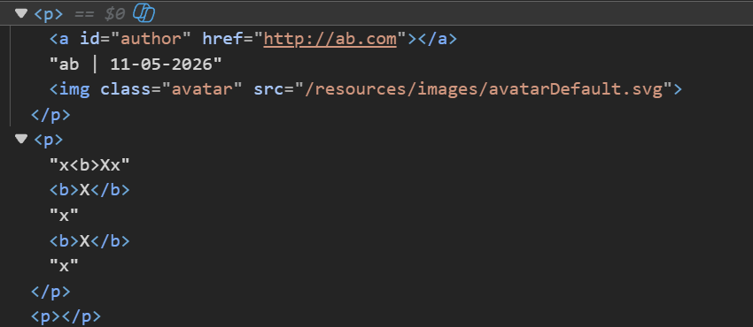
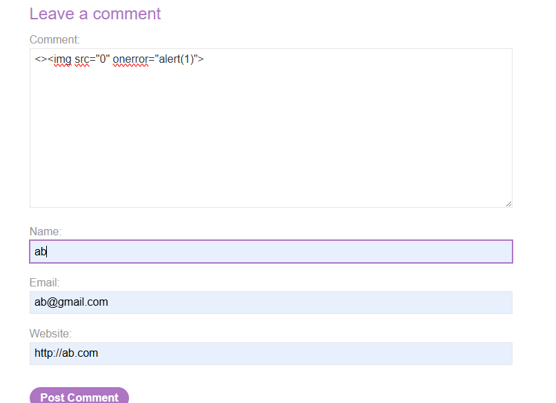
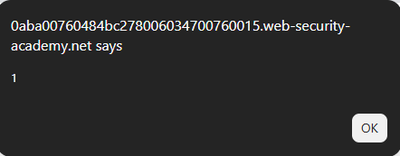
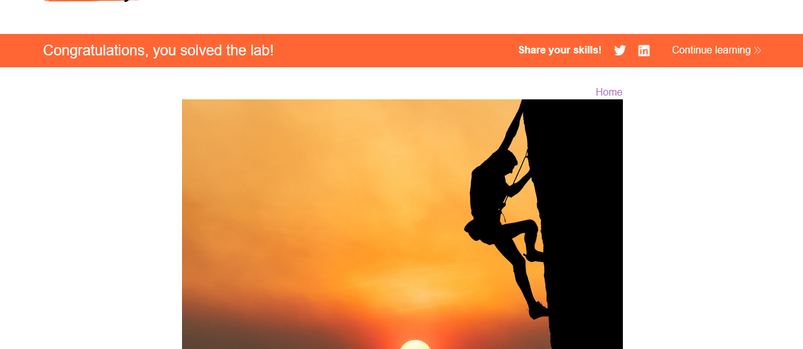
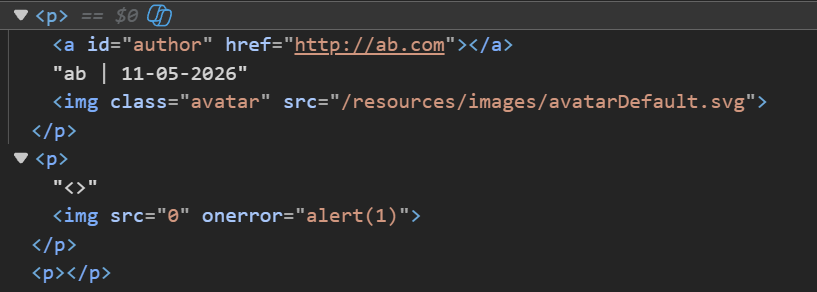

# Lab: Stored DOM XSS

## Mô tả lab

Bài lab này thuộc nhóm lỗi Stored DOM XSS. Lỗ hổng nằm trong chức năng bình luận của bài viết. Mục tiêu của bài lab là khai thác lỗ hổng để hiển thị hộp thoại `alert()`.

## Các bước thực hiện

## Phân tích chức năng bình luận

Thử payload đơn giản:

```html
<script>alert(1)</script>
```



Sau khi gửi comment, nội dung hiển thị trên trang không thực thi JavaScript.



Quan sát HTML sau khi comment được render, có thể thấy ứng dụng đã thực hiện một số xử lý để ngăn chặn XSS.



Điểm đáng chú ý là một số ký tự `<` và `>` đã bị escape hoặc loại bỏ, nhưng cơ chế xử lý này không áp dụng đầy đủ cho toàn bộ input.

## Kiểm tra cơ chế filter

Để kiểm tra kỹ hơn, gửi comment với nhiều thẻ HTML lặp lại:

```html
x<b>X</b>x<b>X</b>x<b>X</b>x
```



Kết quả cho thấy chỉ cặp ký tự `<` và `>` đầu tiên bị xử lý, còn các thẻ HTML phía sau vẫn được đưa vào DOM.

Điều này cho thấy filter chỉ xử lý lần xuất hiện đầu tiên, không xử lý toàn bộ chuỗi input.

## Payload

Thay vì dùng thẻ `<script>`, sử dụng thẻ `` với thuộc tính `onerror`.

Payload cuối cùng:

```html
<>
```







Lab solved.

