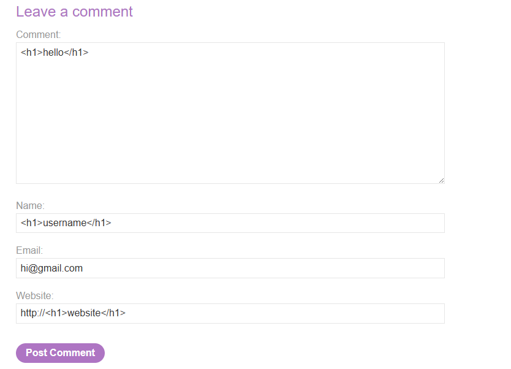
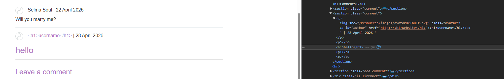
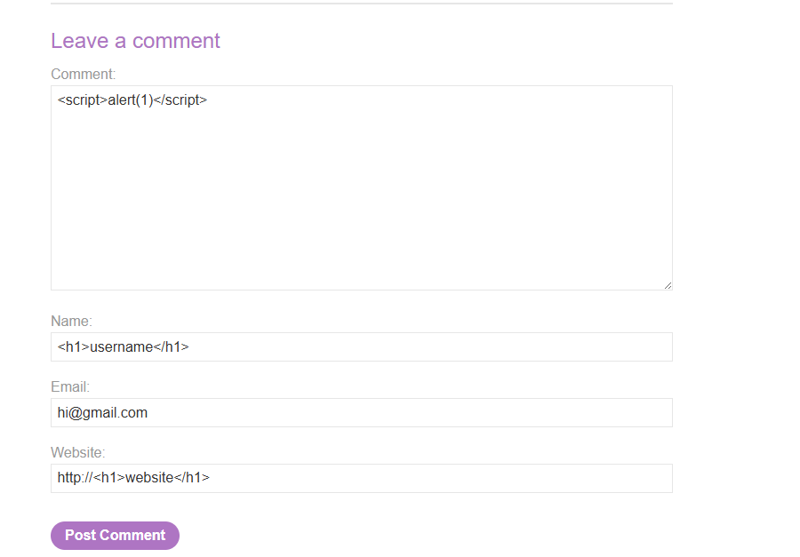
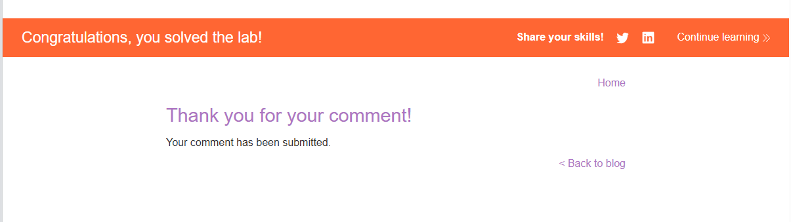

# Lab: Stored XSS into HTML context with nothing encoded

## Mô tả lab

Bài lab này thuộc nhóm lỗi Stored XSS. Ứng dụng là một nền tảng blog cho phép người dùng để lại bình luận dưới các bài viết. Mục tiêu của bài lab là chèn được một payload XSS vào phần bình luận để khi trang được tải lại, đoạn script sẽ được thực thi.

## Các bước thực hiện

### Phân tích form bình luận

Đầu tiên, truy cập một bài viết trong blog và thử gửi một bình luận có chứa thẻ HTML ở nhiều trường khác nhau như:

- Name
- Email
- Website
- Comment

Mục đích là xem dữ liệu ở trường nào sẽ được phản chiếu lại lên trang mà không bị mã hóa.

### Kiểm tra trường nào không được encode



Sau khi gửi bình luận thử nghiệm, kiểm tra HTML của trang thì thấy:



Nội dung trong comment vẫn giữ nguyên các thẻ HTML đã nhập

Điều này cho thấy trường comment đang bị chèn trực tiếp vào HTML response mà không qua escaping.

### Chèn payload XSS

Gửi một bình luận chứa payload đơn giản:

```html
<script>alert(1)</script>
```





Lab solved.