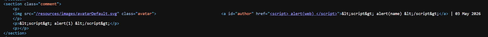
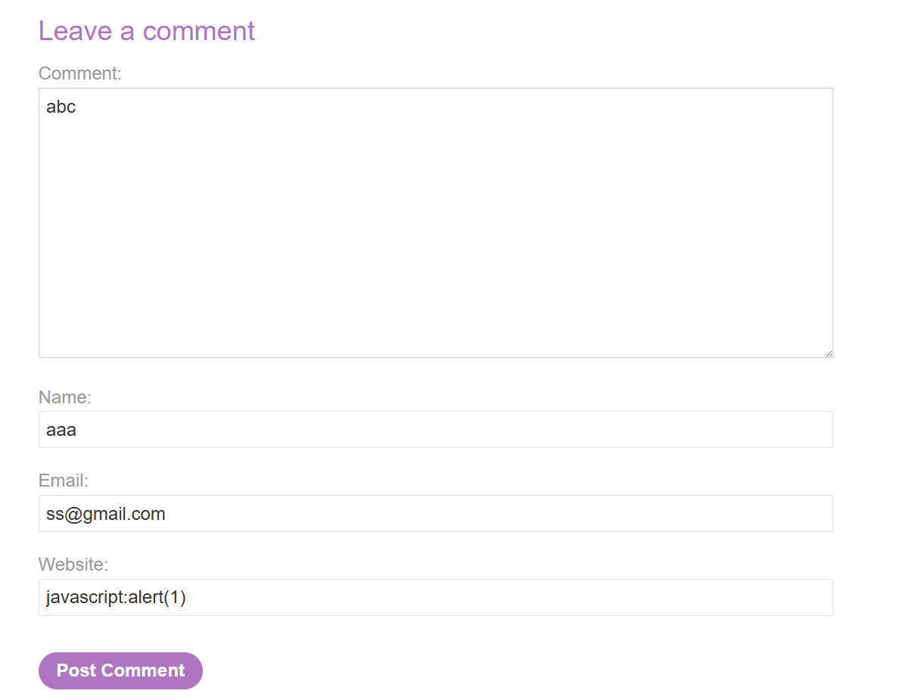
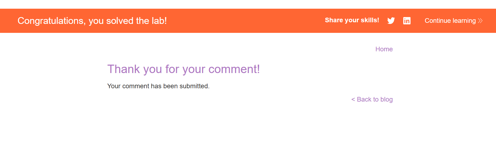
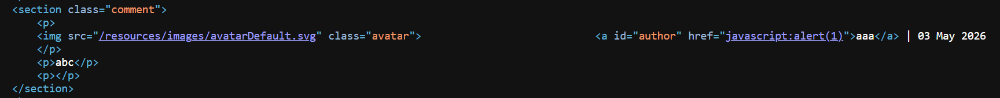

# Lab: Stored XSS into anchor href attribute with double quotes HTML-encoded

## Mô tả lab

Bài lab này thuộc nhóm lỗi Stored XSS trong chức năng bình luận. Điểm yếu của bài nằm ở trường website. Dữ liệu từ trường này được đưa vào thuộc tính `href` của liên kết tên tác giả. Mục tiêu của bài lab là làm cho khi người dùng bấm vào tên tác giả của comment, JavaScript sẽ được thực thi.

## Các bước thực hiện

### Phân tích form bình luận

Đầu tiên, gửi một comment thử nghiệm có chứa đoạn mã javascript vào các trường khác nhau (trừ email).

Khi kiểm tra HTML kết quả, có thể thấy:



- `name` và `comment` đã encode
- `website` thì không bị khóa chặt như vậy

Điều này cho thấy input ở trường website có tiềm năng dẫn đến XSS.

### Khai thác

Payload ở mục website:

```text
javascript:alert(document.domain)
```





Lab solved.

