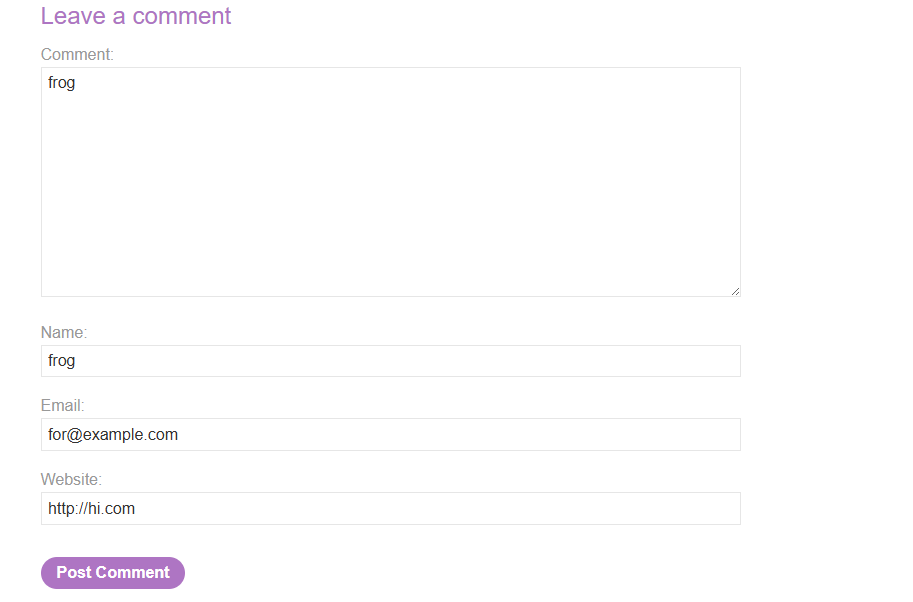
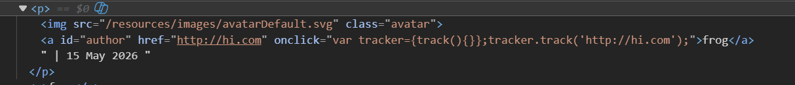
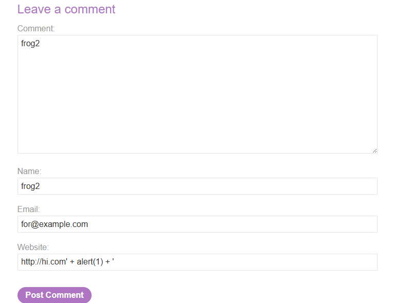
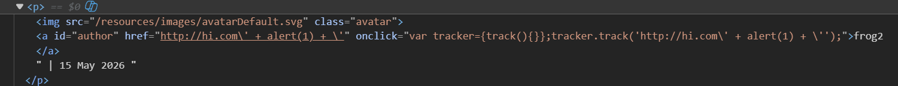
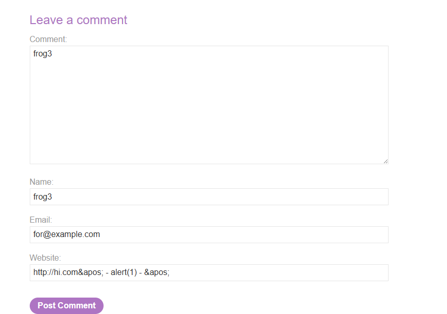
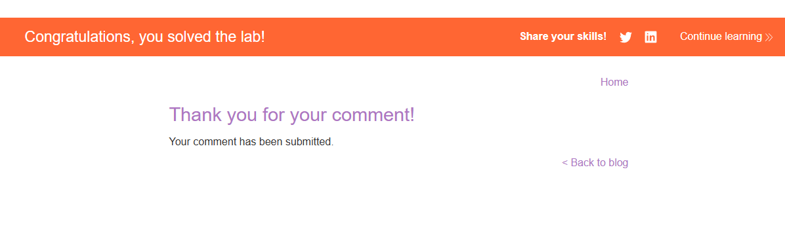
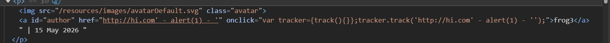

# Lab: Stored XSS into `onclick` event with angle brackets and double quotes HTML-encoded and single quotes and backslash escaped

## Mô tả lab

Bài lab này thuộc nhóm lỗi Stored XSS. Lỗ hổng nằm trong chức năng comment của bài viết. Mục tiêu của bài lab là tạo một comment sao cho khi click vào tên tác giả, trình duyệt gọi hàm: `alert()`


## Các bước thực hiện

## Phân tích chức năng comment

Gửi một comment test:



Quan sát HTML, website của comment được đưa vào đoạn JavaScript trong event `onclick`:



```javascript
tracker.track('http://hi.com');
```

Nếu có thể thoát khỏi chuỗi trong `tracker.track()`, ta có thể chèn JavaScript để thực thi khi người dùng click vào tên tác giả.

## Phân tích cơ chế escape

Thử escape chuỗi:





Quan sát response cho thấy dấu `'` bị escape thành `\'`.

Trình duyệt sẽ HTML-decode giá trị trong attribute trước khi đưa nó cho JavaScript parser xử lý. Vì vậy ta có thể dùng HTML entity để biểu diễn dấu single quote.

```html
&apos;
```

Điều này cho phép ta đưa dấu `'` vào JavaScript sau bước HTML decode, mà không bị server escape như dấu `'` nhập trực tiếp.

## Payload

Dùng `&apos;` để đóng chuỗi trong `tracker.track()`, sau đó chèn lệnh `alert()`.





Lab solved.

